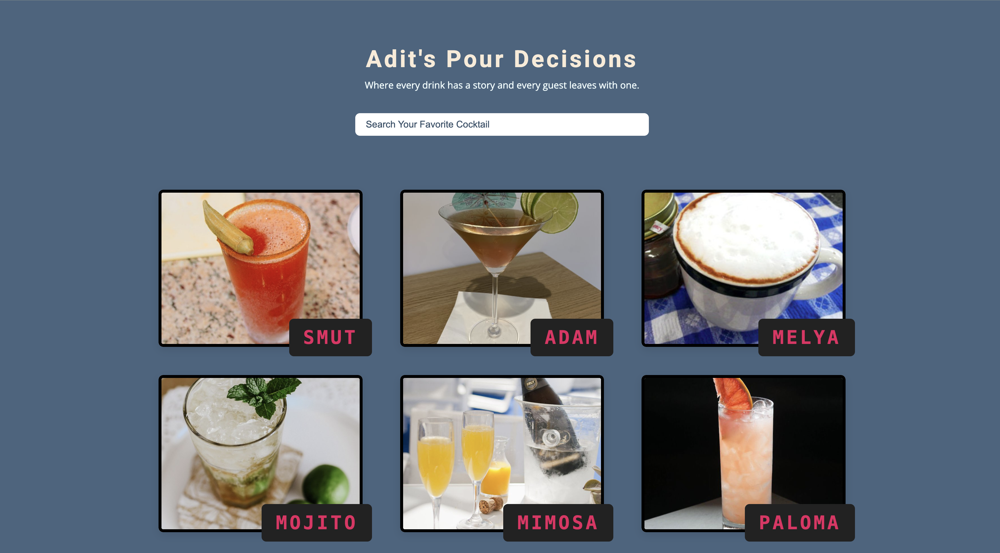
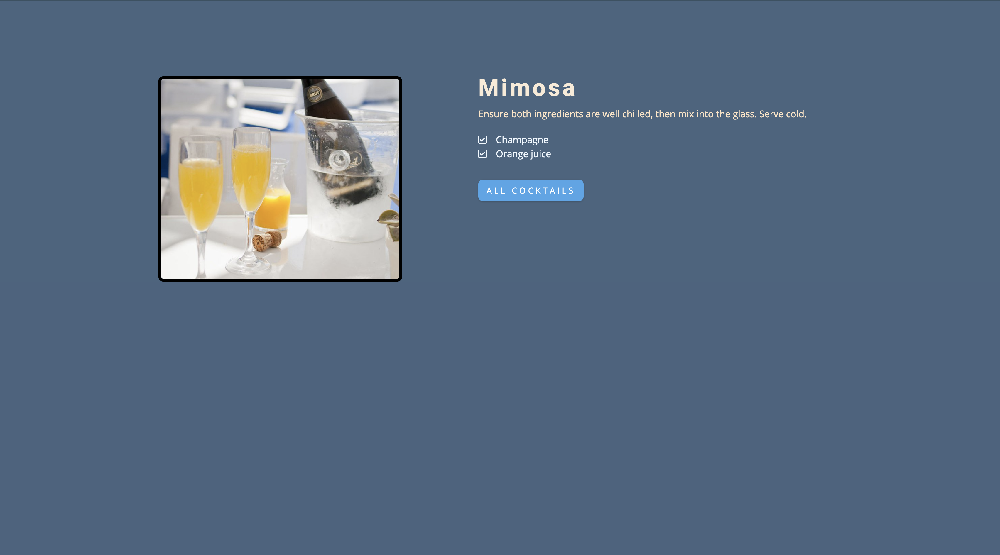

# The King's Pint 🍺

**Adit's Pour Decisions** - Where every drink has a story and every guest leaves with one.

A simple, elegant cocktail discovery web application that helps users search and explore cocktail recipes using 'The Cocktail DB' API.

## Screenshots

### Homepage


### Single Drink View


## Features

- **Search Functionality**: Search for your favorite cocktails by name
- **Cocktail Discovery**: Browse cocktail recipes with detailed information
- **Responsive Design**: Clean, user-friendly interface that works across devices
- **Single Drink View**: Detailed view for individual cocktail recipes
- **Loading States**: Smooth loading animations for better user experience


## Getting Started

### Prerequisites

- A modern web browser
- Local web server (recommended for proper module loading)

### Installation

1. Clone or download the project files
2. Serve the files using a local web server:
   ```bash
   # Using Python 3
   python -m http.server 8000
   
   # Using Node.js (if you have http-server installed)
   npx http-server
   
   # Using PHP
   php -S localhost:8000
   ```
3. Open your browser and navigate to `http://localhost:8000`

## How It Works

1. **Main Page (`index.html`)**: Features a search form and displays cocktail results
2. **Search**: Users can search for cocktails using the search input
3. **Results**: Cocktails are fetched from The Cocktail DB API and displayed in a grid
4. **Single Drink**: Clicking on a cocktail navigates to a detailed view
5. **Storage**: Uses localStorage to pass drink ID between pages

## API Integration

This project uses [The Cocktail DB API](https://www.thecocktaildb.com/api.php):
- Search endpoint: `https://www.thecocktaildb.com/api/json/v1/1/search.php?s={query}`
- Lookup endpoint: `https://www.thecocktaildb.com/api/json/v1/1/lookup.php?i={id}`

## Technologies Used

- **HTML5**: Semantic markup structure
- **CSS3**: Responsive styling and animations
- **Vanilla JavaScript**: ES6+ modules and async/await
- **Font Awesome**: Icons for enhanced UI
- **The Cocktail DB API**: Cocktail data source

## File Descriptions

- **`app.js`**: Main application entry point that loads initial cocktails and sets up the search form
- **`index.html`**: Main page template with search form and cocktail display sections
- **`singleDrink.js`**: Handles the single cocktail page, retrieving drink ID from localStorage and displaying detailed information

## Browser Compatibility

- Chrome 61+
- Firefox 60+
- Safari 10.1+
- Edge 16+

*Note: ES6 modules require a modern browser or local server for proper functionality.*

## Contributing

Feel free to fork this project and submit pull requests for any improvements or bug fixes.

## License

This project is open source and available under the [MIT License](LICENSE).

---

*Cheers! 🍻*