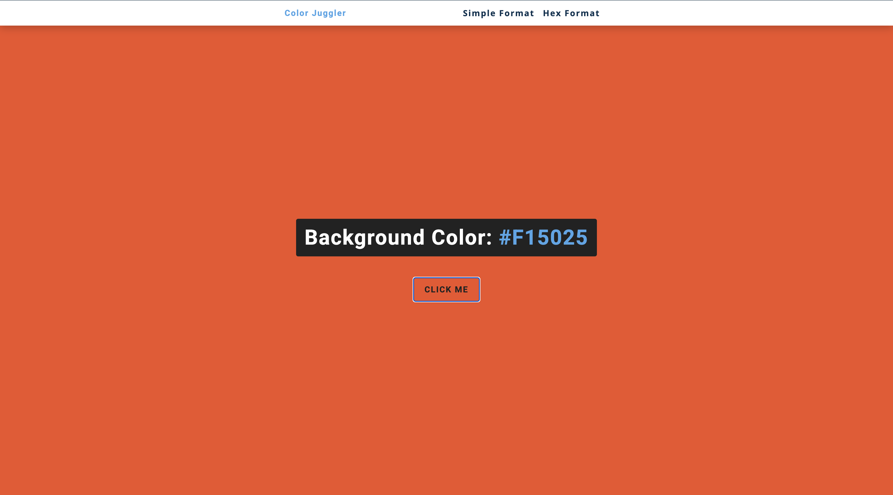

# Color Juggler 🎨

A fun and interactive web application that generates random background colors with the click of a button. Choose between simple color formats or hex color codes for endless color exploration.

## Screenshot



## Features

- **Two Color Modes**: Switch between simple named colors and hex color codes
- **Random Color Generation**: Click to generate completely random colors
- **Real-time Display**: See the color name/code update as the background changes
- **Clean Navigation**: Easy switching between color modes
- **Responsive Design**: Works seamlessly across different screen sizes
- **Instant Feedback**: Immediate visual response to user interactions

## Demo

### Simple Format
- Cycles through predefined colors: green, red, rgba(133,122,200), and #f15025
- Perfect for beginners to understand basic color formats

### Hex Format  
- Generates random 6-digit hex color codes
- Produces over 16 million possible color combinations
- Great for designers and developers

## Getting Started

### Prerequisites

- A modern web browser
- No additional dependencies required

### Installation

1. Clone or download the project files
2. Open `index.html` in your web browser to start with simple format
3. Use the navigation to switch between Simple and Hex formats

### Running Locally

You can run this project by:
1. Double-clicking `index.html` to open in your default browser
2. Or serve via a local web server:
   ```bash
   # Using Python 3
   python -m http.server 8000
   
   # Using Node.js
   npx http-server
   ```

## How It Works

### Simple Format (`index.html` + `app.js`)
- Uses a predefined array of 4 colors
- Generates random index to select from the array
- Updates both background color and display text

### Hex Format (`hex.html` + `hex.js`)
- Uses array of hex characters: `[0, 1, 2, 3, 4, 5, 6, 7, 8, 9, "A", "B", "C", "D", "E", "F"]`
- Loops 6 times to build a complete hex color code
- Each position randomly selects from the hex character array
- Generates colors in format: `#RRGGBB`

## Code Structure

### Core Functionality
Both versions follow the same pattern:
1. **Event Listener**: Button click triggers color change
2. **Random Generation**: Mathematical randomization for color selection
3. **DOM Manipulation**: Updates background color and text display
4. **Utility Function**: `getRandomNumber()` for generating random indices

### Key Functions
- `getRandomNumber()`: Generates random index based on array length
- Button event listener: Handles color generation and DOM updates
- Color assignment: Updates both `document.body.style.backgroundColor` and display text

## Technologies Used

- **HTML5**: Semantic markup and structure
- **CSS3**: Styling and responsive design
- **Vanilla JavaScript**: DOM manipulation and event handling
- **No external libraries**: Pure JavaScript implementation

## Browser Compatibility

- Chrome 1+
- Firefox 1+
- Safari 1+
- Internet Explorer 6+
- Edge (all versions)

*Works in virtually all browsers due to simple JavaScript implementation*

## File Descriptions

- **`index.html`**: Main page featuring simple color format with navigation
- **`hex.html`**: Alternative page for hex color format generation
- **`app.js`**: Logic for simple color format using predefined color array
- **`hex.js`**: Logic for hex color generation using character array and loops
- **`styles.css`**: Styling for both pages including navigation and button design


## License

This project is open source and available under the [MIT License](LICENSE).

---

*Keep juggling those colors! 🌈*