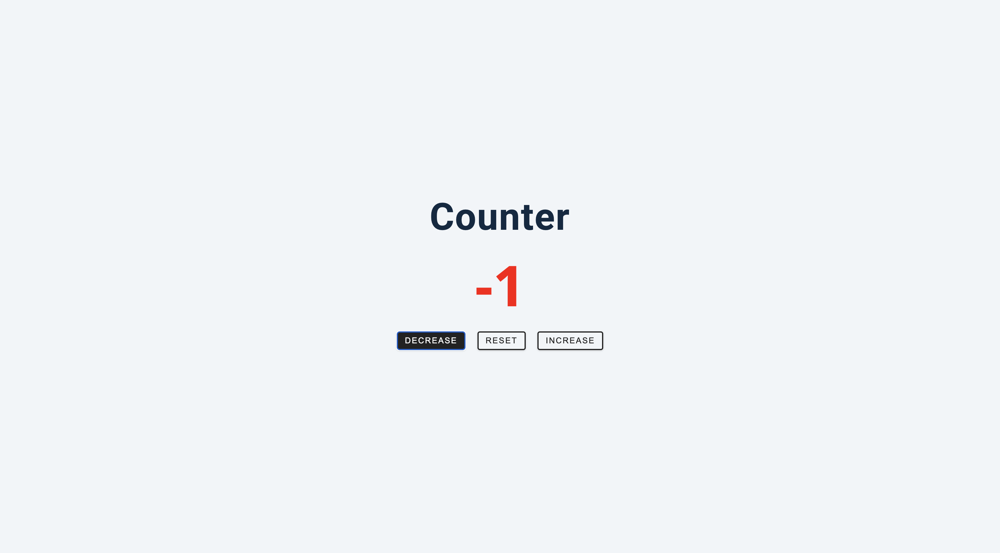

# Counter App 🔢

A simple, interactive counter application that allows users to increment, decrement, or reset a numerical value with visual feedback through color-coded display.

## Screenshot



## Features

- **Increment Counter**: Increase the counter value by 1
- **Decrement Counter**: Decrease the counter value by 1
- **Reset Counter**: Set the counter back to 0
- **Visual Feedback**: Color-coded display based on counter value
  - Green for positive numbers
  - Red for negative numbers
  - Black for zero
- **Clean Interface**: Simple, intuitive design with clear button controls
- **Responsive Design**: Works seamlessly across different screen sizes

## Demo

The counter starts at 0 and responds to button clicks:
- Click "Increase" to add 1
- Click "Decrease" to subtract 1
- Click "Reset" to return to 0
- Watch the number color change based on its value


## Getting Started

### Prerequisites

- A modern web browser
- No additional dependencies required

### Installation

1. Clone or download the project files
2. Open `index.html` in your web browser
3. Start clicking buttons to interact with the counter

### Running Locally

You can run this project by:
1. Double-clicking `index.html` to open in your default browser
2. Or serve via a local web server:
   ```bash
   # Using Python 3
   python -m http.server 8000
   
   # Using Node.js
   npx http-server
   ```

## How It Works

### Counter Logic
1. **Initialization**: Counter starts at 0
2. **Button Detection**: Uses `classList.contains()` to identify which button was clicked
3. **Value Modification**: Updates counter based on button type:
   - Decrease: `count--`
   - Increase: `count++`
   - Reset: `count = 0`
4. **Visual Update**: Changes display color and text content

### Color Coding System
```javascript
if(count > 0) {
    value.style.color = 'green';    // Positive numbers
} else if(count < 0) {
    value.style.color = 'red';      // Negative numbers
} else {
    value.style.color = 'black';    // Zero
}
```

## Code Structure

### HTML Elements
- `#value`: Displays the current counter value
- `.btn.decrease`: Button to decrease counter
- `.btn.increase`: Button to increase counter
- `.btn.reset`: Button to reset counter

### JavaScript Components

#### Variables
```javascript
let count = 0;                                    // Counter state
const value = document.querySelector('#value');   // Display element
const btns = document.querySelectorAll('.btn');   // All buttons
```

#### Event Handling
- **Event Delegation**: Single event listener for all buttons
- **Class Detection**: Uses `classList.contains()` to determine action
- **Dynamic Styling**: Updates color based on counter value
- **Content Update**: Displays new counter value

### Core Functionality

#### Button Event Listener
```javascript
btns.forEach(function(btn) {
    btn.addEventListener('click', function(e){
        // Determine action based on button class
        // Update counter value
        // Apply color coding
        // Update display
    });
});
```

## Technologies Used

- **HTML5**: Semantic markup and structure
- **CSS3**: Styling and responsive design
- **Vanilla JavaScript**: DOM manipulation and event handling
- **No external libraries**: Pure JavaScript implementation

## Browser Compatibility

- Chrome 1+
- Firefox 1+
- Safari 1+
- Internet Explorer 9+
- Edge (all versions)

*Works in all modern browsers with full DOM API support*

## File Descriptions

- **`index.html`**: Main page featuring counter display and control buttons
- **`app.js`**: Complete counter logic including event handling and visual updates
- **`styles.css`**: Styling for clean, responsive counter interface


## License

This project is open source and available under the [MIT License](LICENSE).

---

*Keep counting! 🚀*