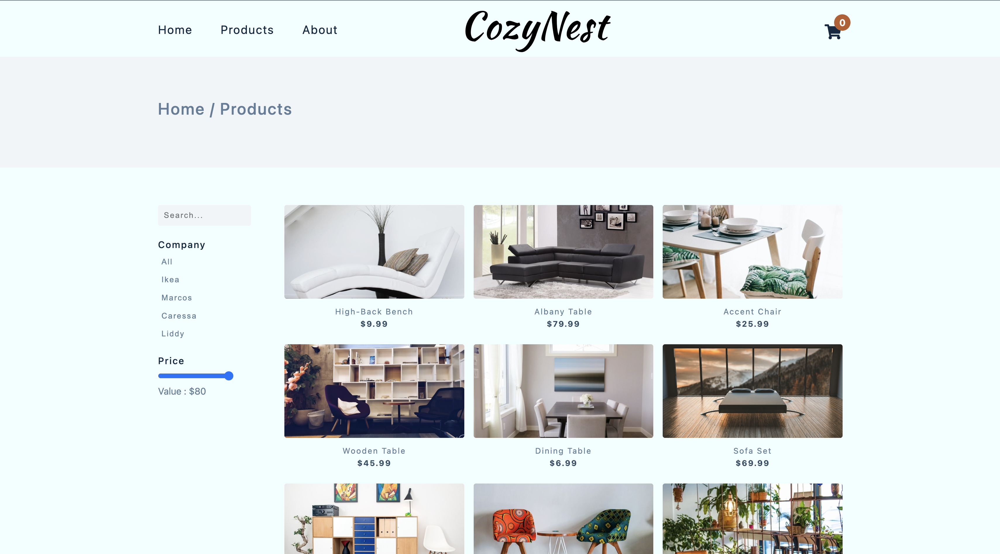
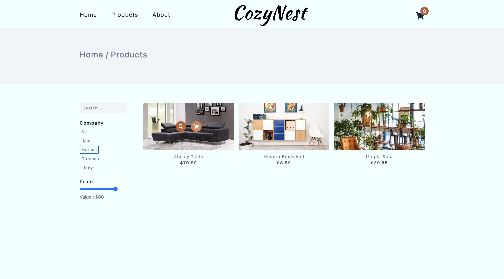
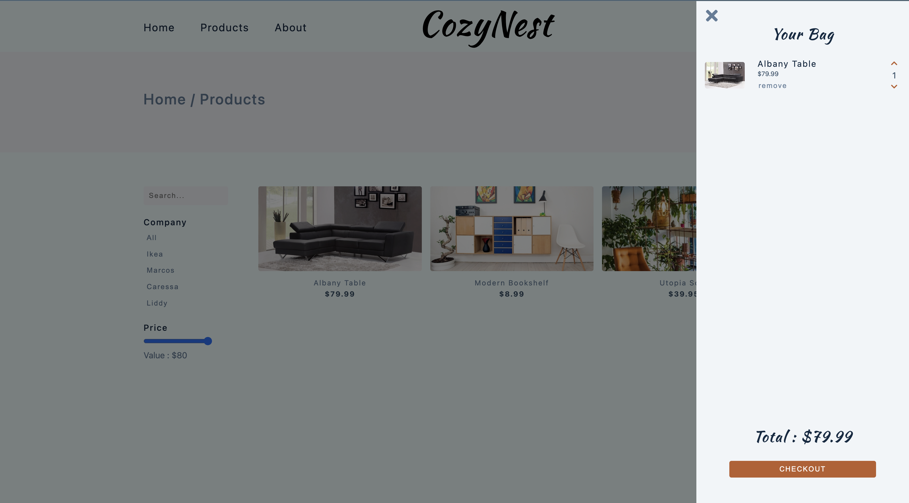

# CozyNest Living

A modern, responsive e-commerce website for furniture shopping built with vanilla JavaScript, HTML5, and CSS3.

## 🏠 Overview

CozyNest Living is a fully functional e-commerce website specializing in stylish, affordable, and quality furniture. The project showcases modern web development practices with a focus on user experience, responsive design, and modular JavaScript architecture.

**Mission**: To make beautiful furniture accessible to everyone, everywhere, helping people create spaces they love.

## ✨ Features

- **Responsive Design**: Mobile-first approach ensuring optimal viewing across all devices
- **Product Catalog**: Browse through a curated collection of furniture pieces
- **Search & Filter**: Find products by name, company, and price range
- **Shopping Cart**: Add, remove, and manage items with persistent cart functionality
- **Product Details**: Individual product pages with detailed information
- **Navigation**: Intuitive navigation with sidebar menu for mobile devices
- **Loading States**: Smooth loading animations and states
- **Modern UI**: Clean, contemporary design with smooth animations

## Screenshots

### Homepage


### Featured Productz


### All Products


### Filtered Products


### Cart



## 🛠 Technologies Used

- **HTML5**: Semantic markup and structure
- **CSS3**: Modern styling with Flexbox/Grid layouts
- **Vanilla JavaScript (ES6+)**: Modular architecture with ES6 modules
- **Font Awesome**: Icons for enhanced UI/UX
- **External APIs**: Product data fetching (assumed from structure)


## 🚀 Installation

1. **Clone the repository**
   ```bash
   git clone https://github.com/yourusername/cozynest-living.git
   cd cozynest-living
   ```

2. **Set up a local server**
   
   Since the project uses ES6 modules, you'll need to serve it through a web server:
   
   **Option 1: Using Python**
   ```bash
   python -m http.server 8000
   ```
   
   **Option 2: Using Node.js (http-server)**
   ```bash
   npm install -g http-server
   http-server
   ```
   
   **Option 3: Using Live Server (VS Code extension)**
   - Install the Live Server extension in VS Code
   - Right-click on `index.html` and select "Open with Live Server"

3. **Open in browser**
   Navigate to `http://localhost:8000` (or the port shown by your server)

## 💻 Usage

### For Users
1. **Browse Products**: Visit the homepage to see featured products
2. **View All Products**: Click "all products" or navigate to the products page
3. **Search & Filter**: Use the search bar and filters on the products page
4. **Product Details**: Click on any product to view detailed information
5. **Shopping Cart**: Add items to cart and manage your selections
6. **Learn More**: Visit the about page to learn about CozyNest Living

### For Developers
- Modify product data in the fetch functions
- Customize styling in `styles.css`
- Add new features by creating additional modules in the `src/` directory
- Extend functionality by adding new pages and corresponding JavaScript files

## 📄 Pages Overview

### Homepage (`index.html`)
- Hero section with call-to-action
- Featured products display
- Navigation to other sections

### Products Page (`products.html`)
- Complete product catalog
- Search functionality
- Company and price filters
- Responsive product grid

### Single Product Page (`product.html`)
- Detailed product information
- Product images
- Add to cart functionality
- Product specifications

### About Page (`about.html`)
- Company history and mission
- Brand story and values
- Contact information

## 🔧 JavaScript Modules

The project uses a modular JavaScript architecture:

- **`fetchProducts.js`**: Handles API calls and data fetching
- **`store.js`**: Manages application state and product storage
- **`displayProducts.js`**: Renders product listings and cards
- **`utils.js`**: Common utility functions
- **`toggleSidebar.js`**: Mobile navigation functionality
- **`cart/`**: Shopping cart related functionality
- **`pages/`**: Page-specific JavaScript logic

## 🎨 Styling

The project uses a mobile-first responsive design approach with:
- CSS Grid and Flexbox for layouts
- CSS custom properties for consistent theming
- Smooth transitions and animations
- Accessible color schemes and typography
- Font Awesome icons for enhanced UI

## 🤝 Contributing

1. Fork the repository
2. Create a feature branch (`git checkout -b feature/amazing-feature`)
3. Commit your changes (`git commit -m 'Add some amazing feature'`)
4. Push to the branch (`git push origin feature/amazing-feature`)
5. Open a Pull Request


## 📝 License

This project is licensed under the MIT License - see the [LICENSE](LICENSE) file for details.


---

**CozyNest Living** - *Your home, your story. Let's furnish it together.*