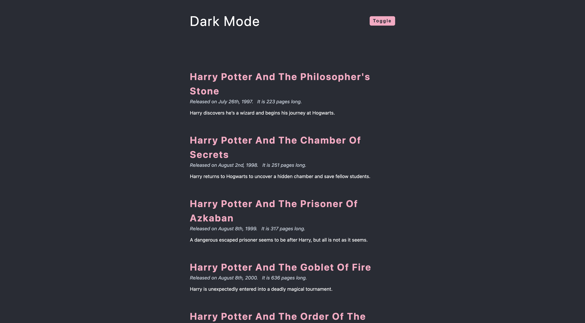
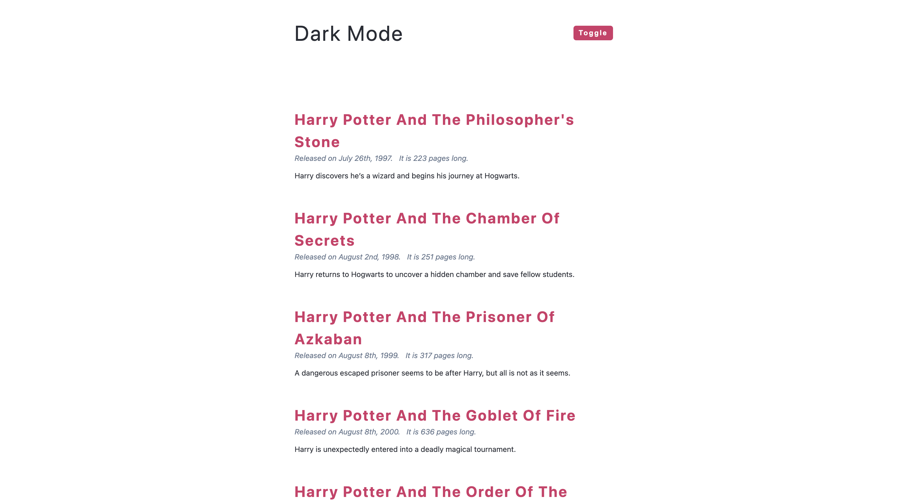

# Dark Mode Toggle Project

A responsive web application that displays Harry Potter book information with a toggleable dark mode feature. Users can switch between light and dark themes while browsing through book details including release dates, page counts, and summaries.

## Screenshots

### Dark Mode


### Light Mode


## Features

- **Dark Mode Toggle**: Seamless switching between light and dark themes
- **Responsive Design**: Optimized for various screen sizes
- **Dynamic Content**: Book information dynamically rendered from JavaScript data
- **Date Formatting**: Human-readable date formatting using Moment.js
- **Clean UI**: Modern and intuitive user interface

## Technologies Used

- **HTML5**: Semantic markup structure
- **CSS3**: Styling and theme management
- **JavaScript (ES6+)**: DOM manipulation and event handling
- **Moment.js**: Date formatting library


## File Overview

### `index.html`
- Main HTML structure with navigation and articles container
- Links to external Moment.js library via CDN
- Includes references to local CSS and JavaScript files

### `data.js`
- Contains an array of Harry Potter book objects
- Each book includes: id, title, release date, page count, and summary
- Data spans all seven books in the series

### `app.js`
- Implements dark mode toggle functionality
- Dynamically renders book articles from data
- Uses Moment.js for date formatting
- Handles DOM manipulation and event listeners

## Getting Started

### Prerequisites
- A modern web browser
- Local web server (optional, for best experience)

### Installation

1. Clone or download the project files
2. Ensure all files are in the same directory
3. Open `index.html` in your web browser

### Running the Project

#### Option 1: Direct Browser Opening
```bash
# Navigate to project directory and open index.html
open index.html  # macOS
start index.html # Windows
xdg-open index.html # Linux
```

#### Option 2: Local Server (Recommended)
```bash
# Using Python 3
python -m http.server 8000

# Using Node.js (if you have http-server installed)
npx http-server

# Then visit: http://localhost:8000
```

## Usage

1. **View Books**: The page automatically displays all Harry Potter books with their details
2. **Toggle Dark Mode**: Click the "toggle" button in the navigation to switch between light and dark themes
3. **Responsive Viewing**: Resize your browser window to see the responsive design in action

## Book Data Structure

Each book object contains:
```javascript
{
  id: Number,           // Unique identifier
  title: String,        // Book title
  release_date: Date,   // Publication date
  pages: Number,        // Number of pages
  summary: String       // Brief description
}
```

## Browser Compatibility

- Modern browsers with ES6+ support
- Chrome 60+
- Firefox 55+
- Safari 12+
- Edge 79+

## Dependencies

- **Moment.js** (v2.29.1): Used for date formatting
  - Loaded via CDN from cdnjs.cloudflare.com
  - Provides the `moment()` function for date manipulation

## Contributing

1. Fork the project
2. Create a feature branch (`git checkout -b feature/new-feature`)
3. Commit your changes (`git commit -am 'Add new feature'`)
4. Push to the branch (`git push origin feature/new-feature`)
5. Create a Pull Request

## License

This project is open source and available under the [MIT License](LICENSE).