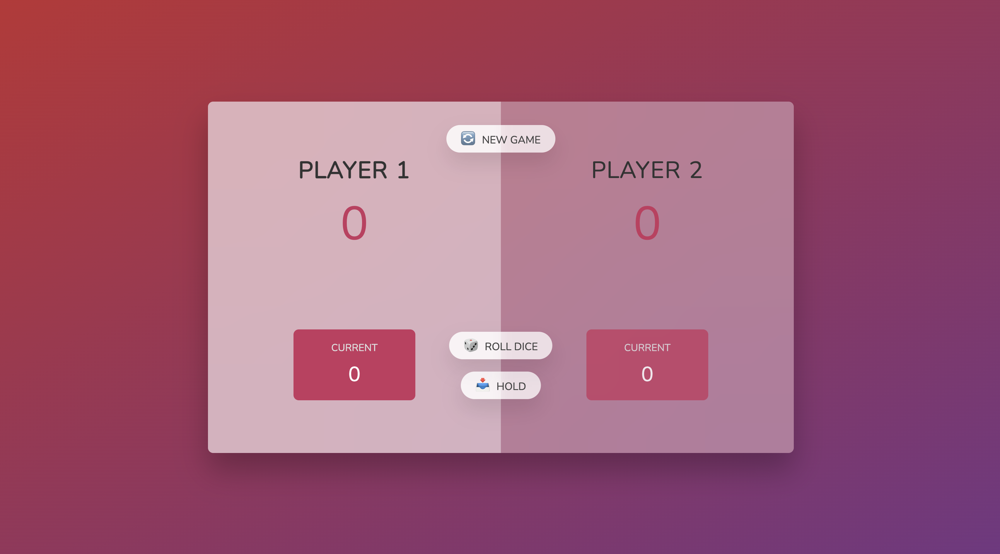
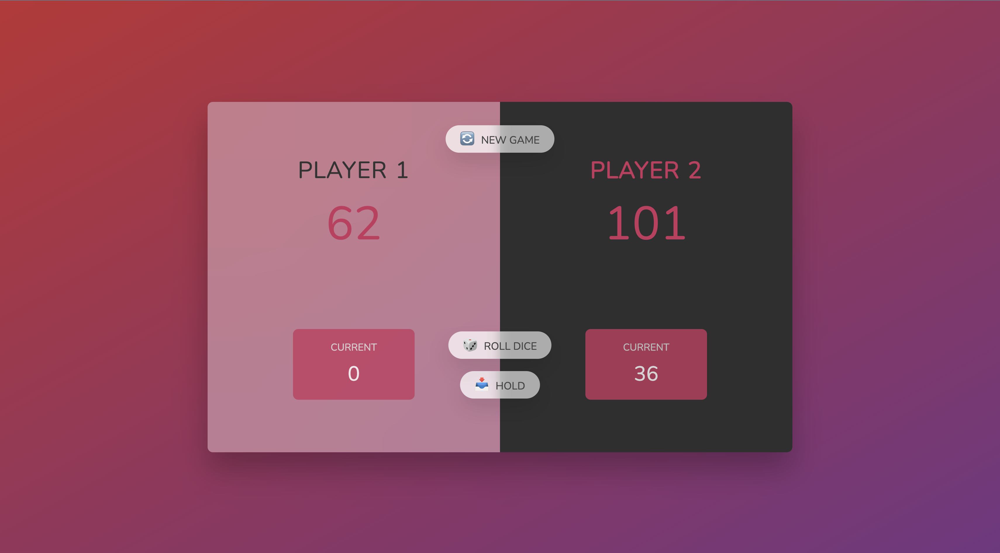

# Dice Game 🎲

A competitive two-player dice game built with HTML, CSS, and JavaScript. Race to reach 100 points first, but be careful - roll a 1 and lose your current score!

## Screenshots

### Homepage

### Player Win

## 🎮 How to Play

### Game Objective
Be the first player to reach **100 points** to win the game!

### Game Rules
1. **Two players** take turns rolling a dice
2. On each turn, a player can:
   - **Roll the dice**: Add the dice value to their current score
   - **Hold**: Add their current score to their total score and end their turn
3. **Special Rule**: If you roll a **1**, you lose all points in your current score and your turn ends
4. **Winning**: First player to reach 100 total points wins!

### Turn Mechanics
- **Roll dice** (🎲): Continue building your current score
- **Hold** (📥): Bank your current score and pass the turn
- **Risk vs Reward**: Keep rolling for higher scores, but risk losing everything on a 1!

## ✨ Features

- **Two-Player Competition**: Alternating turns between Player 1 and Player 2
- **Visual Dice**: Dynamic dice images showing the actual roll result
- **Real-time Scoring**: 
  - Current score (temporary, at risk)
  - Total score (banked, safe)
- **Active Player Indicator**: Clear visual indication of whose turn it is
- **Winner Detection**: Game automatically detects and announces the winner
- **Game Reset**: Start a new game anytime with the "New game" button
- **Risk Management**: Strategic decision-making between rolling and holding

## 🚀 Getting Started

### Prerequisites
- A modern web browser (Chrome, Firefox, Safari, Edge)

### Installation
1. Download or clone the project files
2. Ensure you have all required files in the same directory:
   - `index.html`
   - `script.js`
   - `style.css` (referenced but not provided)
   - `dice-1.png` through `dice-6.png` (dice images)
3. Open `index.html` in your web browser

### Running the Game
Simply open `index.html` in any web browser and start playing with a friend!

## 🎯 Game Strategy

### Tips for Success:
- **Low Current Score**: Keep rolling to build up points
- **High Current Score**: Consider holding to secure your points
- **Leading**: Play conservatively when ahead
- **Behind**: Take more risks to catch up
- **Psychology**: Sometimes holding early can pressure your opponent

### Risk Assessment:
- **Probability of rolling 1**: 1/6 (≈16.67%)
- **Safe banking scores**: 15-20 points is often a good balance
- **High-risk territory**: Current scores above 25 points

## 📝 License

This project is open source and available under the [MIT License](LICENSE).

## 🎉 Have Fun!

Gather a friend and see who has the better balance of luck and strategy. May the best roller win! 🏆