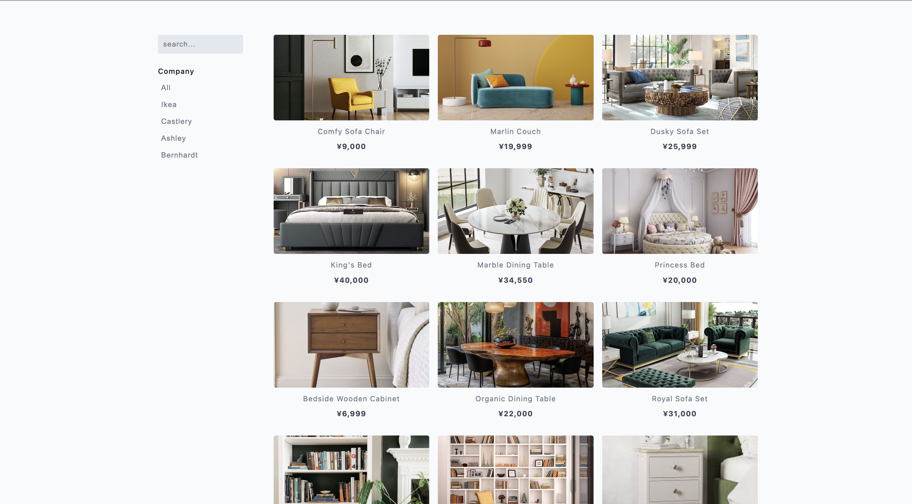
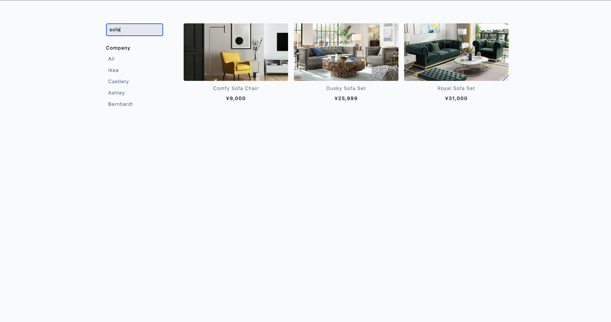

# Product Filter Project

A dynamic furniture e-commerce filter system that allows users to search and filter products by company/brand. The application features real-time text search and category-based filtering with a clean, responsive interface displaying furniture items with images, names, and prices in Japanese Yen (¥).

## Screenshots

### All Products


### Searched Products


## Features

- **Real-time Text Search**: Instant filtering as users type in the search box
- **Company/Brand Filtering**: Filter products by furniture companies (IKEA, Ashley, Castlery, Bernhardt)
- **Dynamic Product Display**: Products rendered dynamically from JavaScript data
- **Responsive Design**: Optimized layout for various screen sizes
- **Interactive UI**: Smooth filtering experience with immediate visual feedback
- **No Results Handling**: User-friendly message when no products match the search criteria

## Technologies Used

- **HTML5**: Semantic markup structure
- **CSS3**: Styling and responsive layout
- **Vanilla JavaScript (ES6+)**: DOM manipulation, event handling, and filtering logic
- **Array Methods**: Map, filter, and set operations for data manipulation


## File Overview

### `index.html`
- Main HTML structure with filter controls and product container
- Search input form for text-based filtering
- Company filter buttons section
- Product display area with sample product structure

### `products.js`
- Contains array of 12 furniture product objects
- Each product includes: id, title, company, image path, and price
- Features products from companies: IKEA, Ashley, Castlery, and Bernhardt

### `app.js`
- Implements all filtering functionality (text search and company filtering)
- Dynamically renders product cards and filter buttons
- Handles user interactions and updates the display
- Manages the `filteredProducts` array for current view state

## Product Data Structure

Each product object contains:
```javascript
{
  id: String,           // Unique identifier
  title: String,        // Product name
  company: String,      // Brand/company name
  image: String,        // Image file path
  price: String         // Price with comma formatting
}
```

## Getting Started

### Prerequisites
- A modern web browser
- Local web server (recommended for image loading)
- Product images in the `images/` directory

### Installation

1. Clone or download the project files
2. Ensure all files are in the same directory structure
3. Place product images in the `images/` folder
4. Open `index.html` in your web browser

### Running the Project

#### Option 1: Local Server (Recommended)
```bash
# Using Python 3
python -m http.server 8000

# Using Node.js (if you have http-server installed)
npx http-server

# Using PHP (if available)
php -S localhost:8000

# Then visit: http://localhost:8000
```

#### Option 2: Direct Browser Opening
```bash
# Navigate to project directory and open index.html
open index.html  # macOS
start index.html # Windows
xdg-open index.html # Linux
```

## Usage

### Text Search
1. **Search Products**: Type in the search input to filter products by name
2. **Real-time Results**: Products filter automatically as you type
3. **Case Insensitive**: Search works regardless of letter case

### Company Filtering
1. **Filter by Brand**: Click any company button to show only products from that brand
2. **View All**: Click "all" button to display all products
3. **Auto-clear Search**: Company filtering automatically clears the search input

### Combined Features
- Company filtering and text search work independently
- Switching company filters resets the text search
- "No products found" message appears when no items match the current filters

## Available Companies

- **All**: Shows all products (default)
- **IKEA**: Swedish furniture retailer products
- **Ashley**: Ashley Furniture products
- **Castlery**: Modern furniture brand products
- **Bernhardt**: Premium furniture manufacturer products

## Key Functions

### `displayProducts()`
- Renders all products in `filteredProducts` array
- Handles empty state with user-friendly message
- Creates product cards with image, name, and price

### `displayButtons()`
- Dynamically generates company filter buttons
- Uses Set to get unique company names
- Adds "all" option automatically

### Text Search Handler
- Listens for `keyup` events on search form
- Filters products by title using case-insensitive matching
- Updates display in real-time

### Company Filter Handler
- Listens for clicks on company buttons
- Filters products by selected company
- Clears search input when company filter is applied

## Browser Compatibility

- Modern browsers with ES6+ support
- Chrome 60+
- Firefox 55+
- Safari 12+
- Edge 79+

## Performance Features

- Efficient array filtering using native JavaScript methods
- Minimal DOM manipulation through innerHTML updates
- Event delegation for filter button clicks
- Debounced search (immediate response on keyup)

## Contributing

1. Fork the project
2. Create a feature branch (`git checkout -b feature/new-feature`)
3. Commit your changes (`git commit -am 'Add new feature'`)
4. Push to the branch (`git push origin feature/new-feature`)
5. Create a Pull Request

## License

This project is open source and available under the [MIT License](LICENSE).
