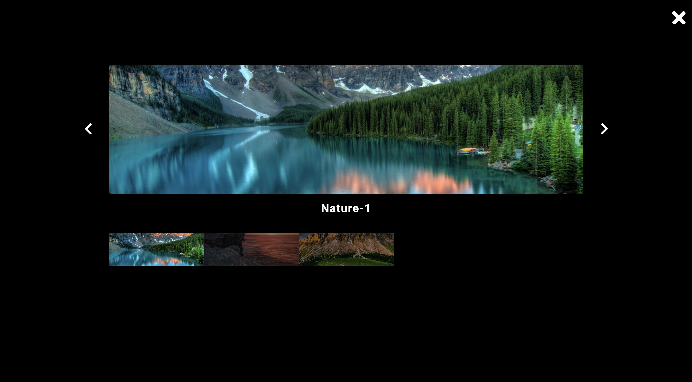

# Gallery Modal Project

An interactive image gallery application built with Object-Oriented JavaScript that displays nature and city photo collections. Features a modal overlay system with image navigation, thumbnail selection, and keyboard controls for an enhanced viewing experience.

## Screenshots

### Homepage


### Image Viewer


## Features

- **Multiple Gallery Support**: Separate nature and city photo collections
- **Modal Image Viewer**: Full-screen modal overlay for detailed image viewing
- **Image Navigation**: Next/Previous buttons with circular navigation
- **Thumbnail Selection**: Click thumbnails to jump to specific images
- **Responsive Design**: Optimized layout for various screen sizes
- **Clean UI**: Modern interface with Font Awesome icons
- **Object-Oriented Architecture**: ES6 Class-based implementation for maintainability
- **Event Management**: Proper event listener cleanup to prevent memory leaks

## Technologies Used

- **HTML5**: Semantic markup structure
- **CSS3**: Modern styling and responsive layout
- **JavaScript ES6+**: Classes, arrow functions, and modern DOM manipulation
- **Font Awesome 5.14.0**: Icon library for UI elements


## File Overview

### `index.html`
- Main HTML structure with two gallery sections (nature and city)
- Modal overlay structure with navigation controls
- Font Awesome CDN integration for icons
- Image elements with proper accessibility attributes

### `app-class.js`
- `getElement()` utility function with error handling
- `Gallery` class with complete modal functionality
- Two gallery instances: nature (3 images) and city (5 images)
- Event handling for clicks, navigation, and modal controls

## Gallery Class Architecture

### Constructor Properties
```javascript
class Gallery {
  constructor(element) {
    this.container        // Gallery container element
    this.list            // Array of gallery images
    this.modal           // Modal overlay element
    this.modalImg        // Main modal image
    this.imageName       // Image title display
    this.modalImages     // Thumbnail container
    this.closeBtn        // Close modal button
    this.nextBtn         // Next image button  
    this.prevBtn         // Previous image button
  }
}
```

### Key Methods

- **`openModal(selectedImage, list)`**: Opens modal with selected image and populates thumbnails
- **`setMainImage(selectedImage)`**: Updates main modal image and title
- **`closeModal()`**: Closes modal and removes event listeners
- **`nextImage()`**: Navigates to next image with circular navigation
- **`prevImage()`**: Navigates to previous image with circular navigation
- **`chooseImage(e)`**: Handles thumbnail clicks for direct image selection

## Getting Started

### Prerequisites
- A modern web browser with ES6+ support
- Local web server (recommended for proper image loading)
- Image files in the `images/` directory

### Installation

1. Clone or download the project files
2. Ensure proper directory structure with images folder
3. Place all required images in the `images/` directory
4. Open `index.html` in your web browser

### Required Images

**Nature Gallery:**
- `nature-1.jpeg`
- `nature-2.jpeg`
- `nature-3.jpeg`

**City Gallery:**
- `city-1.jpeg`
- `city-2.jpeg`
- `city-3.jpeg`
- `city-4.jpeg`
- `city-5.jpeg`

### Running the Project

#### Option 1: Local Server (Recommended)
```bash
# Using Python 3
python -m http.server 8000

# Using Node.js (if you have http-server installed)
npx http-server

# Using PHP (if available)
php -S localhost:8000

# Then visit: http://localhost:8000
```

#### Option 2: Direct Browser Opening
```bash
# Navigate to project directory and open index.html
open index.html  # macOS
start index.html # Windows
xdg-open index.html # Linux
```

## Usage

### Viewing Images
1. **Browse Galleries**: Scroll through nature and city image collections
2. **Open Modal**: Click any image to open it in the modal viewer
3. **View Details**: See the image title displayed below the main image

### Modal Navigation
1. **Next/Previous**: Use arrow buttons to navigate through images
2. **Thumbnail Selection**: Click any thumbnail to jump directly to that image
3. **Close Modal**: Click the X button or outside the modal to close

### Navigation Features
- **Circular Navigation**: Next button wraps to first image after last image
- **Visual Feedback**: Selected thumbnail is highlighted
- **Smooth Transitions**: Clean image switching experience

## Customization

### Adding New Galleries
Create a new gallery by adding HTML structure and instantiating the Gallery class:

```html
<!-- Add new gallery section -->
<section class="section wildlife">
  
  <!-- Add more images... -->
</section>
```

```javascript
// Add new gallery instance
const wildlife = new Gallery(getElement('.wildlife'));
```

### Adding Images to Existing Galleries
Add new image elements to existing gallery sections:

```html

```

### Styling Customization
- Modify `styles.css` to customize appearance
- Gallery images use class: `.img`
- Modal elements use classes: `.modal`, `.modal-content`, `.main-img`
- Navigation buttons use classes: `.prev-btn`, `.next-btn`, `.close-btn`

## Key Features Explained

### Error Handling
The `getElement()` function includes error handling for missing DOM elements:
```javascript
function getElement(selection) {
  const element = document.querySelector(selection);
  if (element) return element;
  throw new Error(`Please check "${selection}" selector, no such element exists`);
}
```

### Event Management
Proper event listener cleanup prevents memory leaks:
- Event listeners are added when modal opens
- Event listeners are removed when modal closes
- Method binding ensures correct `this` context

### Circular Navigation
Navigation seamlessly loops through images:
- Next button: `selected.nextElementSibling || this.modalImages.firstElementChild`
- Previous button: `selected.previousElementSibling || this.modalImages.lastElementChild`

## Browser Compatibility

- Modern browsers with ES6+ support
- Chrome 60+
- Firefox 55+
- Safari 12+
- Edge 79+

## Performance Features

- Efficient DOM queries with caching
- Event delegation for optimal performance
- Minimal DOM manipulation during navigation
- Proper memory management with event cleanup

## Accessibility Features

- Semantic HTML structure
- Alt text for all images
- Title attributes for image descriptions
- Keyboard-friendly navigation buttons
- Focus management for modal interactions


## Contributing

1. Fork the project
2. Create a feature branch (`git checkout -b feature/new-feature`)
3. Commit your changes (`git commit -am 'Add new feature'`)
4. Push to the branch (`git push origin feature/new-feature`)
5. Create a Pull Request

## Development Notes

### Code Organization
- **Separation of Concerns**: HTML structure, CSS styling, and JavaScript functionality are properly separated
- **Reusable Components**: Gallery class can be instantiated multiple times
- **Error Handling**: Robust error handling for missing elements
- **Clean Code**: Consistent naming conventions and code structure

### Best Practices
- Method binding for proper `this` context
- Event listener cleanup to prevent memory leaks
- Defensive programming with element existence checks
- Semantic HTML for accessibility

## License

This project is open source and available under the [MIT License](LICENSE).