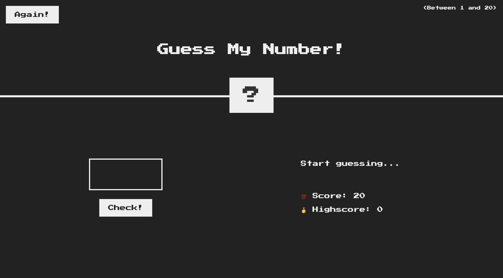
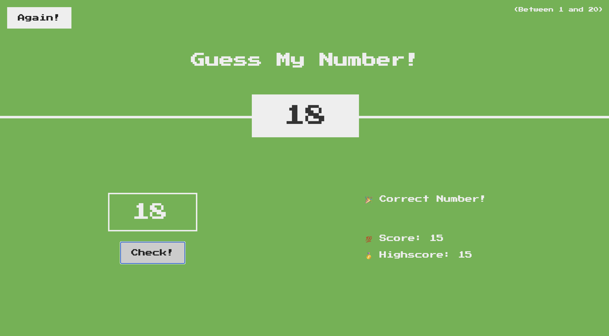
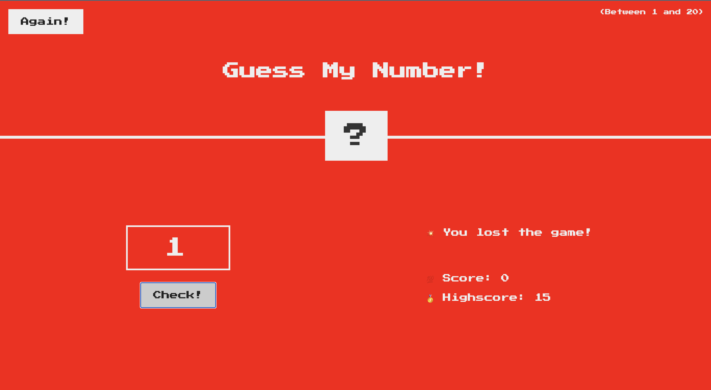

# Guess My Number! 🎯

A fun and interactive number guessing game built with HTML, CSS, and JavaScript. Test your luck and try to guess the secret number between 1 and 20!

## Screenshots

### Homepage

### Game Won

### Game Lost

## 🎮 How to Play

1. The computer generates a random secret number between 1 and 20
2. Enter your guess in the input field
3. Click "Check!" to see if you're correct
4. You start with a score of 20 points
5. Each wrong guess reduces your score by 1
6. Try to guess the number with the highest score possible!

## ✨ Features

- **Random Number Generation**: Each game generates a new random number between 1-20
- **Score System**: Start with 20 points, lose 1 point for each wrong guess
- **Highscore Tracking**: Keeps track of your best score across games
- **Visual Feedback**: 
  - Background turns green when you win
  - Background turns red when you lose
  - Secret number box expands when revealed
- **Helpful Hints**: Get "Too high!" or "Too low!" messages to guide your guesses
- **Reset Functionality**: "Again!" button to start a new game
- **Input Validation**: Handles empty inputs gracefully

## 🚀 Getting Started

### Prerequisites
- A modern web browser (Chrome, Firefox, Safari, Edge)

### Installation
1. Download or clone the project files
2. Ensure you have all three files in the same directory:
   - `index.html`
   - `script.js` 
   - `style.css` (not included but referenced)
3. Open `index.html` in your web browser

### Running the Game
Simply open `index.html` in any web browser and start playing!

## 🎯 Game Rules

- **Winning**: Guess the exact secret number
- **Losing**: Your score reaches 0 before guessing correctly
- **Scoring**: 
  - Start with 20 points
  - Lose 1 point per incorrect guess
  - Your final score when winning becomes your potential highscore

## 🤝 Contributing

Feel free to fork this project and add your own features such as:
- Difficulty levels with different number ranges
- Sound effects
- Animation improvements
- Mobile-responsive design enhancements
- Statistics tracking (games played, win rate, etc.)

## 📝 License

This project is open source and available under the [MIT License](LICENSE).

## 🎉 Enjoy the Game!

Have fun testing your guessing skills and try to achieve the highest score possible!