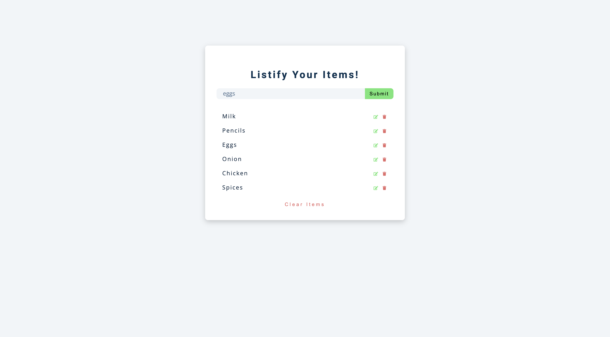

# Listify - Grocery List Manager

A dynamic grocery list application that allows users to add, edit, and delete items with persistent storage. Built with vanilla JavaScript, the app features real-time alerts, local storage integration, and an intuitive user interface for managing shopping lists efficiently.

## Screenshots

### Some Products Added


## Features

- **Add Items**: Quickly add grocery items to your list
- **Edit Items**: Modify existing items with inline editing
- **Delete Items**: Remove individual items or clear entire list
- **Persistent Storage**: Items saved to browser's local storage
- **Real-time Alerts**: Visual feedback for all user actions
- **Responsive Design**: Works seamlessly across all device sizes
- **Clean UI**: Modern interface with Font Awesome icons
- **Auto-load**: Previously saved items load automatically on page refresh
- **Form Validation**: Prevents empty item submissions

## Technologies Used

- **HTML5**: Semantic markup structure
- **CSS3**: Modern styling and responsive layout
- **Vanilla JavaScript (ES6+)**: Complete functionality without frameworks
- **Local Storage API**: Browser-based data persistence
- **Font Awesome 5.14.0**: Professional icons for UI elements

## File Overview

### `index.html`
- Clean, semantic HTML structure with form and list containers
- Font Awesome CDN integration for icons
- Input field with placeholder text and submit button
- Container for dynamic list items and clear functionality

### `app.js`
- Complete CRUD operations (Create, Read, Update, Delete)
- Local storage management functions
- Event handling for form submission, editing, and deletion
- Alert system for user feedback
- Dynamic DOM manipulation for list items

## Key Functionality

### Core Operations

**Add Items**
- Form submission creates new list items
- Generates unique timestamp-based IDs
- Validates input to prevent empty submissions
- Shows success alert and updates storage

**Edit Items**
- Click edit button to modify existing items
- Form switches to edit mode with "edit" button text
- Updates both DOM and local storage
- Provides visual feedback on successful edit

**Delete Items**
- Individual item deletion with trash icon
- Complete list clearing with "clear items" button
- Automatic container hiding when list is empty
- Removes items from local storage

**Persistent Storage**
- Automatic saving to browser's local storage
- Items persist across browser sessions
- Efficient storage with JSON serialization
- Smart loading on page initialization

## Getting Started

### Prerequisites
- A modern web browser with JavaScript enabled
- No additional dependencies or installations required

### Installation

1. Clone or download the project files
2. Ensure all files are in the same directory
3. Open `index.html` in your web browser

### Running the Project

#### Option 1: Direct Browser Opening
```bash
# Navigate to project directory and open index.html
open index.html  # macOS
start index.html # Windows
xdg-open index.html # Linux
```

#### Option 2: Local Server (Optional)
```bash
# Using Python 3
python -m http.server 8000

# Using Node.js (if you have http-server installed)
npx http-server

# Then visit: http://localhost:8000
```

## Usage Guide

### Adding Items
1. **Enter Item**: Type grocery item name in the input field
2. **Submit**: Click "submit" button or press Enter
3. **Confirmation**: See success alert and item appears in list

### Editing Items
1. **Click Edit**: Click the edit icon (pencil) next to any item
2. **Modify**: Item text appears in input field for editing
3. **Save Changes**: Click "edit" button to save modifications
4. **Confirmation**: See success alert confirming the change

### Deleting Items
1. **Single Item**: Click trash icon next to specific item
2. **Clear All**: Click "clear items" button to remove everything
3. **Confirmation**: See alert confirming deletion

### Automatic Features
- **Auto-save**: Items automatically save to browser storage
- **Auto-load**: Previous items load when you revisit the page
- **Smart UI**: Container shows/hides based on list content

## Technical Implementation

### Data Structure
Items are stored as objects with unique identifiers:
```javascript
{
  id: "1640995200000",    // Timestamp-based unique ID
  value: "eggs"           // Item text
}
```

### Key Functions

**`addItem(e)`**
- Handles form submission and item creation
- Manages both add and edit operations based on `editFlag`
- Validates input and provides user feedback

**`deleteItem(e)`**
- Removes individual items from DOM and storage
- Handles container visibility when list becomes empty

**`editItem(e)`**
- Switches interface to edit mode
- Populates form with existing item value
- Sets edit flags for proper form handling

**Local Storage Functions**
- `addToLocalStorage(id, value)`: Adds new items to storage
- `editLocalStorage(id, value)`: Updates existing items
- `removeFromLocalStorage(id)`: Removes specific items
- `getLocalStorage()`: Retrieves all stored items

### Alert System
The app provides three types of alerts:
- **Success (Green)**: Item added, edited successfully
- **Danger (Red)**: Item deleted, validation errors, list cleared
- **Auto-dismiss**: Alerts automatically disappear after 1 second

## Browser Compatibility

- **Chrome 45+**: Full support
- **Firefox 40+**: Full support  
- **Safari 10+**: Full support
- **Edge 12+**: Full support
- **Internet Explorer**: Not supported (requires ES6+ features)

## Performance Features

- **Efficient DOM Manipulation**: Minimal DOM queries with element caching
- **Smart Event Handling**: Event listeners added only when needed
- **Optimized Storage**: JSON serialization for compact data storage
- **Memory Management**: Proper cleanup of event listeners

## Accessibility Features

- **Semantic HTML**: Proper form structure and labels
- **Keyboard Navigation**: Full keyboard accessibility
- **Screen Reader Support**: Meaningful element descriptions
- **Focus Management**: Logical tab order and focus indicators
- **ARIA Labels**: Enhanced accessibility for dynamic content

## Security Considerations

- **Input Sanitization**: HTML content is properly escaped
- **XSS Prevention**: No direct HTML injection from user input
- **Storage Limits**: Browser enforces local storage quotas
- **Client-side Only**: No server-side data transmission

## Troubleshooting

### Items Not Persisting
- **Check Browser Settings**: Ensure local storage is enabled
- **Storage Quota**: Clear browser data if storage limit reached
- **Incognito Mode**: Private browsing may not persist data
- **Browser Support**: Verify browser supports local storage

### Edit Function Not Working
- **JavaScript Errors**: Check browser console for errors
- **Event Listeners**: Ensure buttons have proper event bindings
- **Edit State**: Verify `editFlag` and `editID` are set correctly

### Styling Issues
- **CSS Loading**: Ensure `styles.css` is in correct location
- **Font Awesome**: Verify CDN connection for icons
- **Browser Cache**: Clear cache and refresh page

## Development Notes

### Code Organization
- **Separation of Concerns**: HTML structure, CSS styling, JavaScript functionality
- **Event-Driven Architecture**: Clean event handling patterns
- **Modular Functions**: Each function has single responsibility
- **Error Handling**: Defensive programming practices

### Best Practices Implemented
- **DRY Principle**: Reusable functions like `createListItem()`
- **Consistent Naming**: Clear, descriptive variable and function names
- **Input Validation**: Prevents invalid data entry
- **User Experience**: Immediate feedback for all actions

## Contributing

1. Fork the project
2. Create a feature branch (`git checkout -b feature/new-feature`)
3. Commit your changes (`git commit -am 'Add new feature'`)
4. Push to the branch (`git push origin feature/new-feature`)
5. Create a Pull Request


## License

This project is open source and available under the [MIT License](LICENSE).

---

**Listify** - Making grocery shopping organized and efficient, one item at a time! 🛒