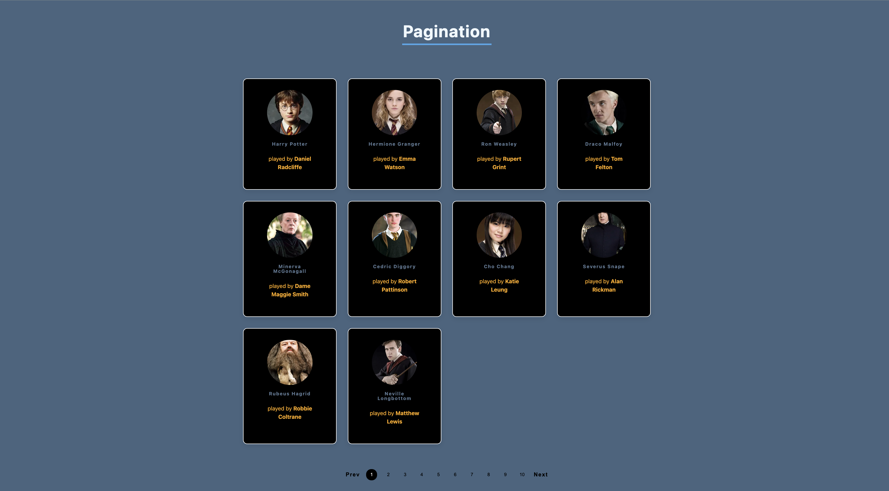
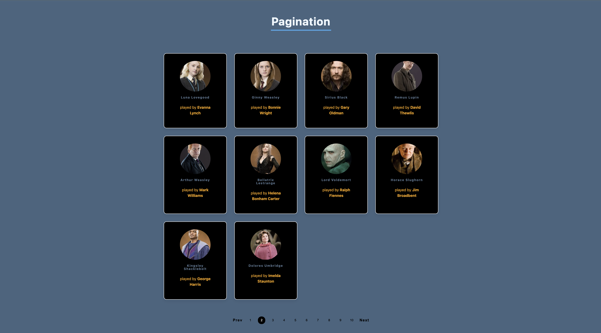

# Harry Potter Characters Pagination

A simple, interactive web application that displays Harry Potter characters with pagination functionality. Built with vanilla JavaScript and ES6 modules.

## Screenshots

### Page 1


### Page 2


## Features

- **Dynamic Data Fetching**: Retrieves Harry Potter character data from an external API
- **Pagination**: Displays characters in pages of 10 items each
- **Interactive Navigation**: Previous/Next buttons and numbered page buttons
- **Responsive Design**: Clean, card-based layout for character display
- **Modular Architecture**: Organized code structure with ES6 modules

## Live Demo

The application displays Harry Potter characters with their images, names, and the actors who portrayed them in the films.

## Files Overview

### `app.js`
Main application controller that:
- Initializes the application
- Handles pagination button clicks
- Manages current page state
- Coordinates between different modules

### `fetchFollowers.js`
Handles data fetching from the Harry Potter API:
- Fetches character data from `https://hp-api.onrender.com/api/characters`
- Limits results to first 100 characters
- Returns processed data for pagination

### `displayFollowers.js`
Renders character cards:
- Creates HTML cards for each character
- Displays character image, name, and actor information
- Updates the DOM with current page characters

### `displayButtons.js`
Manages pagination controls:
- Generates numbered page buttons
- Creates previous/next navigation buttons
- Highlights active page button
- Handles button state management

### `paginate.js`
Handles data pagination logic:
- Splits character array into pages of 10 items
- Calculates total number of pages needed
- Returns array of paginated data chunks

## Installation & Setup

1. Clone or download the project files
2. Ensure all JavaScript files are in the same directory as `index.html`
3. Serve the files using a local web server (required for ES6 modules)

### Using a Local Server

```bash
# Using Python 3
python -m http.server 8000

# Using Node.js (if you have live-server installed)
npx live-server

# Using PHP
php -S localhost:8000
```

4. Open your browser and navigate to `http://localhost:8000`

## How It Works

1. **Initialization**: On page load, the app fetches Harry Potter character data
2. **Data Processing**: Characters are organized into pages of 10 items each
3. **UI Rendering**: First page of characters is displayed with pagination controls
4. **Navigation**: Users can click page numbers, previous, or next buttons to navigate
5. **State Management**: Current page index is tracked and UI updates accordingly

## API Reference

The application uses the [Harry Potter API](https://hp-api.onrender.com/):
- **Endpoint**: `https://hp-api.onrender.com/api/characters`
- **Method**: GET
- **Response**: Array of character objects with properties like `name`, `image`, and `actor`

## Browser Compatibility

- Modern browsers with ES6 modules support
- Chrome 61+
- Firefox 60+
- Safari 10.1+
- Edge 16+


## Contributing

1. Fork the repository
2. Create a feature branch
3. Make your changes
4. Test thoroughly
5. Submit a pull request

## License

This project is open source and available under the [MIT License](LICENSE).