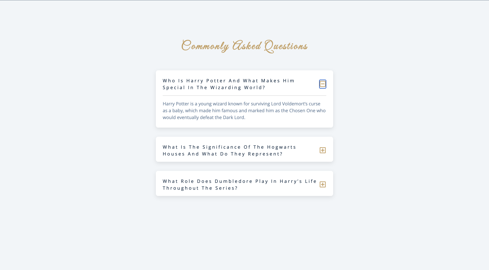

# Harry Potter FAQ Accordion

A responsive FAQ accordion component featuring Harry Potter-related questions and answers. Built with vanilla JavaScript and CSS, providing an interactive way to display frequently asked questions with smooth expand/collapse functionality.

## Screenshots

### Preview


## Features

- **Interactive Accordion**: Click to expand/collapse individual questions
- **Exclusive Mode**: Only one question can be open at a time (auto-closes others)
- **Visual Feedback**: Dynamic plus/minus icons indicate expansion state
- **Responsive Design**: Works seamlessly across different screen sizes
- **Accessibility**: Proper semantic HTML structure with ARIA support
- **Smooth Animations**: CSS-powered transitions for opening/closing sections

## Live Demo

The application displays a clean FAQ interface with Harry Potter-themed questions about characters, Hogwarts houses, and key storylines.

## Files Overview

### `index.html`
Contains the complete HTML structure:
- **Semantic markup** with proper heading hierarchy
- **Three FAQ items** covering Harry Potter topics
- **Font Awesome icons** for plus/minus indicators
- **Google Fonts** integration for enhanced typography
- **Accessible structure** with proper button and content organization

### `app.js`
Implements the accordion functionality:
- **Event delegation** using `querySelectorAll` and `forEach`
- **Toggle mechanism** for expanding/collapsing questions
- **Exclusive behavior** - closes other questions when one opens
- **CSS class manipulation** using `show-text` class

## Installation & Setup

1. **Clone or download** the project files
2. **Ensure all files** are in the same directory
3. **Create the CSS file** (styles.css) or add your own styling
4. **Open index.html** in any modern web browser

## How It Works

1. **Initialization**: JavaScript selects all elements with `.question` class
2. **Event Binding**: Each question gets a click event listener on its button
3. **Click Handler**: When a button is clicked:
   - All other questions are collapsed (exclusive behavior)
   - Current question toggles its expanded state
   - CSS classes are added/removed to trigger visual changes
4. **Visual Feedback**: Icons change from plus to minus based on state

## FAQ Content

The application includes three Harry Potter-themed questions:

1. **Harry Potter's Significance**: About Harry being the Chosen One
2. **Hogwarts Houses**: Explanation of the four houses and their traits
3. **Dumbledore's Role**: His mentorship and guidance throughout the series


## Browser Compatibility

- **Modern Browsers**: Full support in all current browsers
- **Internet Explorer**: IE11+ (with polyfills for older versions)
- **Mobile Browsers**: iOS Safari 10+, Android Chrome 60+

## Dependencies

### External Libraries Used:
- **Font Awesome 5.14.0**: For plus/minus icons
- **Google Fonts**: Great Vibes font family
- **No JavaScript frameworks**: Pure vanilla JavaScript

### CDN Links:
```html
<!-- Font Awesome -->
<link rel="stylesheet" href="https://cdnjs.cloudflare.com/ajax/libs/font-awesome/5.14.0/css/all.min.css" />

<!-- Google Fonts -->
<link href="https://fonts.googleapis.com/css?family=Great+Vibes&display=swap" rel="stylesheet" />
```

## Contributing

1. Fork the repository
2. Create a feature branch (`git checkout -b feature/new-feature`)
3. Make your changes
4. Test across different browsers
5. Commit your changes (`git commit -am 'Add new feature'`)
6. Push to the branch (`git push origin feature/new-feature`)
7. Create a Pull Request

## License

This project is open source and available under the [MIT License](LICENSE).

## Acknowledgments

- **Font Awesome** for the beautiful icons
- **Google Fonts** for typography options
- **Harry Potter universe** created by J.K. Rowling for inspiring the content
- **Web accessibility guidelines** for inclusive design principles