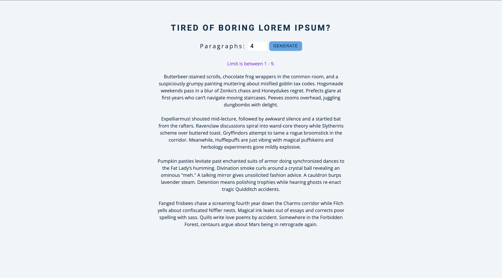

# Harry Potter Text Generator

A whimsical alternative to Lorem Ipsum that generates magical placeholder text inspired by the Harry Potter universe. Perfect for designers, developers, and Potterheads who want to add a touch of magic to their projects while working with dummy text.

## Screenshots

### Preview

## Features

- **Magical Placeholder Text**: 9 unique paragraphs filled with Harry Potter references
- **Customizable Output**: Generate 1-9 paragraphs based on user input
- **Input Validation**: Handles invalid inputs with user-friendly error messages
- **Responsive Design**: Clean, simple interface that works on all devices
- **Instant Generation**: Real-time text generation without page reload
- **Creative Content**: Humorous and imaginative descriptions of Hogwarts life

## Live Demo

Enter a number between 1-9 and click "generate" to create magical placeholder text featuring Butterbeer, Quidditch mishaps, mischievous house-elves, and more wizarding world chaos.

## Files Overview

### `index.html`
Simple, clean HTML structure featuring:
- **Form interface** with number input and submit button
- **Semantic markup** for accessibility
- **Clear instructions** and usage limits
- **Results container** for generated text display

### `app.js`
Core functionality including:
- **Text array** with 9 unique Harry Potter-themed paragraphs
- **Form submission handling** with preventDefault
- **Input validation** for range checking (1-9)
- **Dynamic text rendering** with proper formatting
- **Error handling** for invalid inputs

## Sample Generated Content

The generator includes magical scenarios like:
- Butterbeer-stained scrolls and chocolate frog wrappers
- Peeves causing chaos with dungbombs
- Magical portraits arguing about fashion
- Dobby organizing sock exchanges
- Quidditch practice mishaps and glitter explosions
- Sentient slime molds applying for prefect status

## Installation & Setup

1. **Download the files** and place them in the same directory
2. **Create a CSS file** (styles.css) for styling
3. **Open index.html** in any modern web browser
4. **No server required** - runs entirely in the browser

## How It Works

1. **Text Storage**: 9 pre-written paragraphs stored in JavaScript array
2. **User Input**: Form accepts number input (1-9 paragraphs)
3. **Validation**: Checks if input is valid number within range
4. **Generation**: Slices text array based on user input
5. **Display**: Renders selected paragraphs with proper spacing
6. **Error Handling**: Shows error message for invalid inputs

## Usage Examples

### Basic Usage
1. Enter a number between 1-9 in the input field
2. Click the "generate" button
3. Generated text appears below the form

### Input Validation
- **Valid inputs**: Numbers 1-9 generate corresponding paragraphs
- **Invalid inputs**: Text fields, negative numbers, or numbers > 9 show error
- **Empty input**: Treated as invalid, shows error message

## Browser Compatibility

- **Modern Browsers**: Full support in all current browsers
- **Internet Explorer**: IE11+ (basic functionality)
- **Mobile Browsers**: iOS Safari 10+, Android Chrome 60+
- **No Dependencies**: Pure vanilla JavaScript, no frameworks needed

## License

This project is open source and available under the [MIT License](LICENSE).