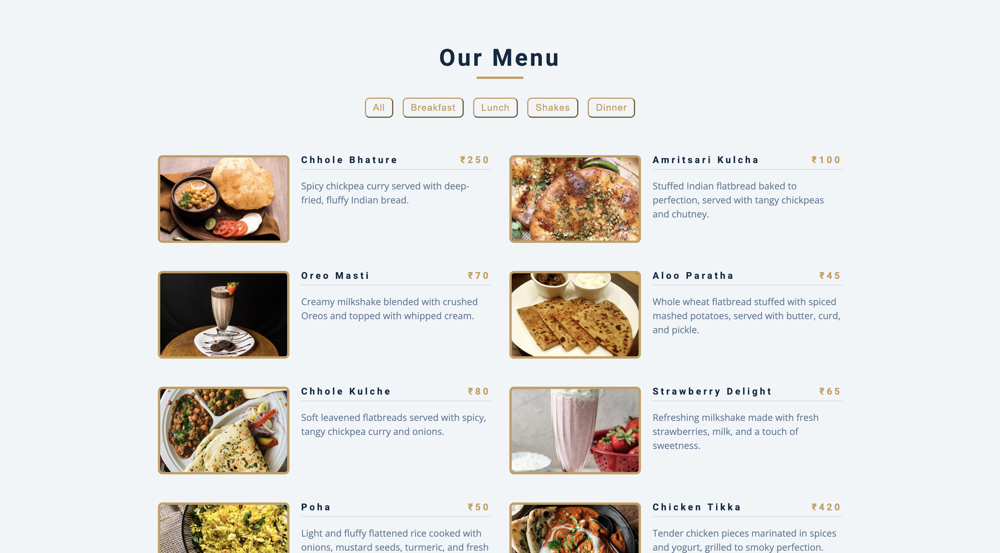

# Indian Restaurant Menu Filter

A dynamic, interactive restaurant menu application featuring authentic Indian cuisine with advanced filtering capabilities. Built with vanilla JavaScript, this project demonstrates modern web development techniques including DOM manipulation, event handling, and responsive design principles.

## Screenshots

### Menu

## Features

- **Interactive Menu Display**: 10 authentic Indian dishes with images, prices, and descriptions
- **Category Filtering**: Filter menu items by breakfast, lunch, dinner, and shakes
- **Dynamic Button Generation**: Automatically creates filter buttons based on available categories
- **Responsive Design**: Optimized layout for all screen sizes
- **Real-time Updates**: Instant filtering without page reload
- **Indian Currency Display**: Prices displayed in Indian Rupees (₹)
- **Rich Content**: Detailed descriptions and appetizing food photography

## Live Demo

Experience an interactive Indian restaurant menu with dishes ranging from traditional Chhole Bhature and Butter Chicken to refreshing Oreo Masti shakes, all with seamless category filtering.

## Menu Categories

### Breakfast (3 items)
- **Chhole Bhature** (₹250) - Spicy chickpea curry with fluffy fried bread
- **Aloo Paratha** (₹45) - Potato-stuffed flatbread with accompaniments
- **Poha** (₹50) - Flattened rice with onions and spices

### Lunch (3 items)
- **Amritsari Kulcha** (₹100) - Stuffed flatbread with chickpeas
- **Chhole Kulche** (₹80) - Soft flatbreads with spicy chickpea curry
- **Chicken Tikka** (₹420) - Grilled marinated chicken pieces

### Dinner (2 items)
- **Dal Makhani** (₹370) - Creamy black lentils with butter and spices
- **Butter Chicken** (₹450) - Succulent chicken in creamy tomato gravy

### Shakes (2 items)
- **Oreo Masti** (₹70) - Creamy Oreo milkshake with whipped cream
- **Strawberry Delight** (₹65) - Fresh strawberry milkshake

## Files Overview

### `index.html`
Clean, semantic HTML structure featuring:
- **Menu title section** with decorative underline
- **Dynamic button container** for category filters
- **Menu items container** populated via JavaScript
- **Font Awesome integration** for potential icon usage
- **Accessibility-focused markup** with proper headings and structure

### `app.js`
Comprehensive JavaScript functionality including:
- **Menu data array** with 10 detailed food items
- **Dynamic content rendering** using template literals
- **Category extraction** using reduce method for unique categories
- **Event delegation** for filter button functionality
- **DOM manipulation** for real-time content updates

## Installation & Setup

1. **Clone or download** the project files
2. **Create images directory** and add food images matching the filenames in the menu data
3. **Create styles.css** for custom styling
4. **Open index.html** in any modern web browser

## Browser Compatibility

- **Modern Browsers**: Full support in all current browsers
- **Internet Explorer**: IE11+ (with minimal polyfills)
- **Mobile Browsers**: iOS Safari 10+, Android Chrome 60+
- **Performance**: Optimized for smooth filtering on mobile devices

## Contributing

1. Fork the repository
2. Create a feature branch (`git checkout -b feature/menu-enhancement`)
3. Make your improvements:
   - Add new Indian dishes and categories
   - Implement search functionality
   - Add price range filtering
   - Enhance accessibility features
   - Improve mobile responsiveness
4. Test across different browsers and devices
5. Commit your changes (`git commit -am 'Add menu enhancements'`)
6. Push to the branch (`git push origin feature/menu-enhancement`)
7. Create a Pull Request

## License

This project is open source and available under the [MIT License](LICENSE).