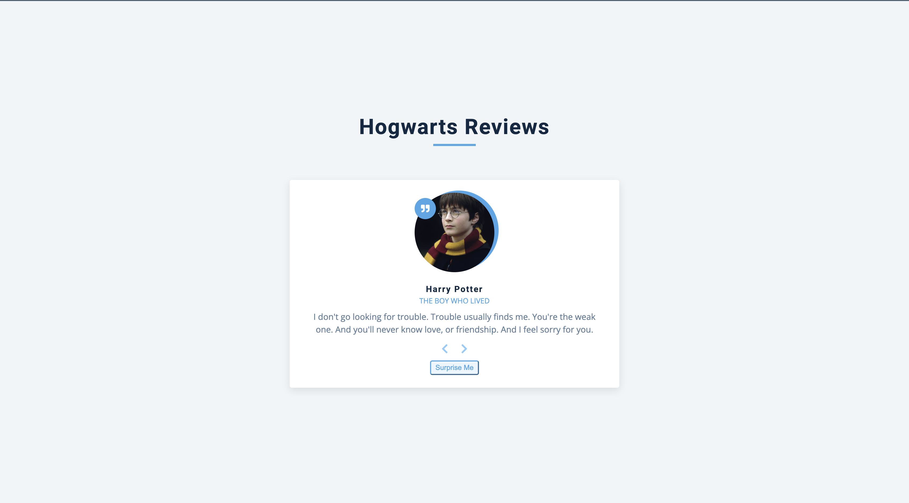

# Hogwarts Reviews

A dynamic web application showcasing reviews and quotes from beloved Harry Potter characters. Navigate through memorable quotes from Hogwarts' most famous students and staff with an interactive carousel interface.

## Screenshots

### Menu


## 🧙‍♂️ Features

- **Character Carousel**: Browse through reviews from Harry Potter, Hermione Granger, Ron Weasley, and Albus Dumbledore
- **Navigation Controls**: Previous/Next buttons for sequential browsing
- **Random Selection**: "Surprise Me" button for random character quotes
- **Responsive Design**: Clean, modern interface that works on all devices
- **Character Profiles**: Each review includes character name, role, image, and memorable quote

## 🏰 Characters Featured

- **Harry Potter** - The Boy Who Lived
- **Hermione Granger** - The Intelligent One
- **Ron Weasley** - The Chess Master & a Weasley
- **Albus Dumbledore** - The Headmaster

## 🚀 Getting Started

### Prerequisites

- A modern web browser (Chrome, Firefox, Safari, Edge)
- No additional installations required

### Installation

1. Clone or download the project files
2. Ensure you have the following files in your project directory:
   ```
   ├── index.html
   ├── app.js
   ├── styles.css (not included in provided files)
   └── README.md
   ```

### Running the Application

1. Open `index.html` in your web browser
2. The application will load automatically with Harry Potter's quote displayed first

## 🎮 How to Use

- **Next Button**: Click the right arrow (→) to view the next character's review
- **Previous Button**: Click the left arrow (←) to view the previous character's review
- **Surprise Me**: Click the "surprise me" button to display a random character's review
- The carousel loops infinitely - after the last character, it returns to the first

## 🛠️ Technical Details

### File Structure

- **`index.html`**: Main HTML structure and layout
- **`app.js`**: JavaScript functionality for carousel navigation and data management
- **`styles.css`**: CSS styling (referenced but not provided)

### Key Components

- **Reviews Data**: Array of character objects with id, name, job, image URL, and quote text
- **DOM Manipulation**: Dynamic content updates using JavaScript
- **Event Listeners**: Button click handlers for user interaction
- **State Management**: Current item tracking for carousel position

### Dependencies

- **Font Awesome 5.14.0**: For navigation icons
- **External Images**: Character images hosted on external domains


## 🌟 Features in Detail

### Navigation Logic

- **Sequential Navigation**: Maintains current position and moves forward/backward
- **Infinite Loop**: Wraps around at beginning/end
- **Random Selection**: Uses Math.random() for surprise functionality

### Image Handling

- External image URLs are used for character portraits
- Images are dynamically loaded via JavaScript
- Alt text is included for accessibility

## 🔧 Browser Compatibility

- Modern browsers with ES6 support
- Tested on Chrome, Firefox, Safari, and Edge
- Responsive design works on desktop and mobile devices

## 📝 Code Quality

- Clean, readable JavaScript code
- Semantic HTML structure
- Modular function design
- Consistent naming conventions

## 🎭 Harry Potter Theme

This project celebrates the magical world of Harry Potter with:
- Iconic character quotes
- Hogwarts-themed styling
- Character role descriptions
- Memorable dialogue from the series

## 🤝 Contributing

Feel free to contribute by:
- Adding more characters and quotes
- Improving the styling
- Enhancing functionality
- Fixing bugs or improving performance

## 📄 License

This project is for educational and entertainment purposes. Harry Potter characters and quotes are property of J.K. Rowling and Warner Bros.

---

*"Happiness can be found, even in the darkest of times, if one only remembers to turn on the light."* - Albus Dumbledore