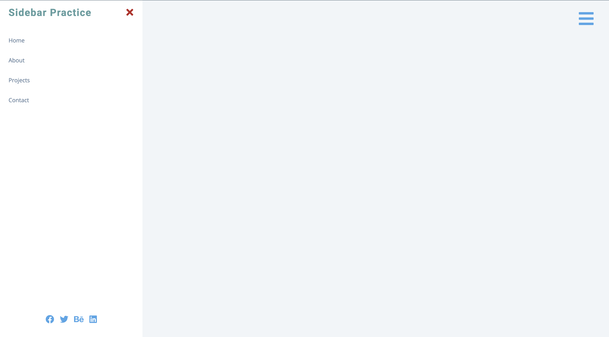

# Sidebar Navigation

A clean, responsive sidebar navigation component built with vanilla HTML, CSS, and JavaScript. Perfect for mobile-first designs and modern web applications that need collapsible navigation menus.

## Screenshots

### Preview



## 🚀 Features

- **Toggle Functionality**: Hamburger menu button to show/hide sidebar
- **Close Button**: Dedicated close button inside the sidebar
- **Responsive Design**: Works seamlessly on desktop and mobile devices
- **Social Media Links**: Integrated social media icon links
- **Smooth Animations**: CSS transitions for opening/closing (requires styling)
- **Accessibility**: Proper semantic HTML structure

## 📱 Components

### Navigation Links
- Home
- About
- Projects
- Contact

### Social Media Integration
- Facebook
- Twitter
- Behance
- LinkedIn

## 🛠️ Getting Started

### Prerequisites

- A modern web browser (Chrome, Firefox, Safari, Edge)
- No additional installations or dependencies required

### Installation

1. Clone or download the project files
2. Ensure you have the following files in your project directory:
   ```
   ├── index.html
   ├── app.js
   ├── styles.css (not included in provided files)
   └── README.md
   ```

### Running the Application

1. Open `index.html` in your web browser
2. Click the hamburger menu (☰) button to open the sidebar
3. Click the close button (✕) or toggle button again to close

## 🎮 How to Use

### Opening the Sidebar
- Click the hamburger menu button (three horizontal lines) in the top-left corner
- The sidebar will slide in from the left side of the screen

### Closing the Sidebar
- Click the "✕" close button inside the sidebar header
- Or click the hamburger menu button again to toggle closed

### Navigation
- Click any navigation link to navigate to different pages
- Click social media icons to visit respective social platforms


## 🎯 Implementation Details

### Event Listeners

The application uses two main event listeners:

1. **Toggle Button**: Uses `classList.toggle()` for efficient show/hide
2. **Close Button**: Uses `classList.remove()` to ensure sidebar closes

### DOM Selection

```javascript
const toggleBtn = document.querySelector(".sidebar-toggle");
const closeBtn = document.querySelector(".close-btn");
const sidebar = document.querySelector(".sidebar");
```


## 🔧 Browser Compatibility

- **Modern Browsers**: Full support for ES6+ features
- **IE11+**: Compatible with polyfills if needed
- **Mobile Browsers**: Optimized for touch interactions
- **Screen Readers**: Semantic HTML structure supports accessibility


## 📄 License

This project is open source and available for educational and commercial use. Font Awesome icons are subject to their respective licenses.

---

*Simple, clean, and effective sidebar navigation for modern web applications.*