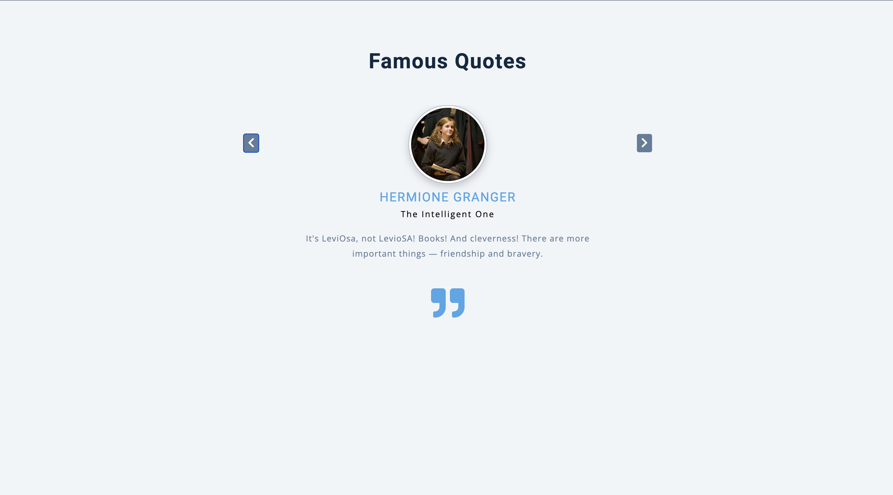

# Famous Quotes Slider

An elegant, modern slider component showcasing famous quotes from Harry Potter characters. Built with vanilla JavaScript ES6 modules, featuring smooth transitions and intelligent slide management for an optimal user experience.

## Screenshots

### Preview


## 🎭 Features

- **Smooth Slide Transitions**: CSS-powered animations with active, next, and last positioning
- **ES6 Module Architecture**: Clean separation of data and functionality
- **Intelligent Slide Management**: Handles edge cases for 1-2 slides automatically
- **Responsive Design**: Works seamlessly across all device sizes
- **Dynamic Content Generation**: Slides generated programmatically from data
- **Quote Icons**: Elegant quote formatting with Font Awesome icons
- **Edge Case Handling**: Special logic for single slide or two-slide scenarios

## 🧙‍♂️ Characters Featured

- **Harry Potter** - The Boy Who Lived
- **Hermione Granger** - The Intelligent One  
- **Ron Weasley** - The Chess Master & a Weasley
- **Albus Dumbledore** - The Headmaster

## 🚀 Getting Started

### Prerequisites

- Modern web browser with ES6 module support
- Local server (for module imports) or live server extension

### Installation

1. Clone or download the project files
2. Ensure you have the following file structure:
   ```
   ├── index.html
   ├── app.js
   ├── data.js
   ├── styles.css (not included in provided files)
   └── README.md
   ```

### Running the Application

**Important**: Due to ES6 module imports, you need to serve the files from a local server:

1. **Using Live Server (VS Code)**:
   - Install Live Server extension
   - Right-click on `index.html` and select "Open with Live Server"

2. **Using Python**:
   ```bash
   # Python 3
   python -m http.server 8000
   
   # Python 2
   python -m SimpleHTTPServer 8000
   ```

3. **Using Node.js**:
   ```bash
   npx serve .
   ```

4. Open `http://localhost:8000` in your browser

## 🎮 How to Use

### Navigation
- **Next Button**: Click the right arrow (→) to advance to the next quote
- **Previous Button**: Click the left arrow (←) to go back to the previous quote
- **Automatic Looping**: Slides loop infinitely in both directions

### Slide States
- **Active**: Currently displayed slide (center position)
- **Next**: Slide positioned to the right (ready to move in)
- **Last**: Slide positioned to the left (previously active)


## 🔧 Browser Compatibility

- **Modern Browsers**: Full ES6 module support required
- **Chrome 61+**: Native module support
- **Firefox 60+**: Native module support  
- **Safari 10.1+**: Native module support
- **Edge 16+**: Native module support

**Note**: Does not work with `file://` protocol due to CORS restrictions with modules.


## 📄 License

This project is open source and available for educational and commercial use. Harry Potter characters and quotes are property of J.K. Rowling and Warner Bros.

---

*"Happiness can be found, even in the darkest of times, if one only remembers to turn on the light."* - Albus Dumbledore