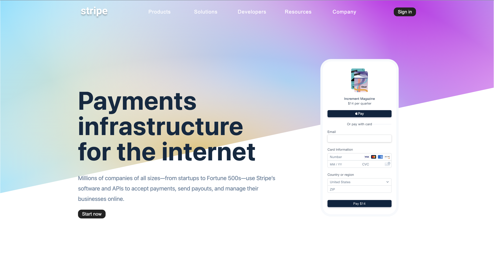
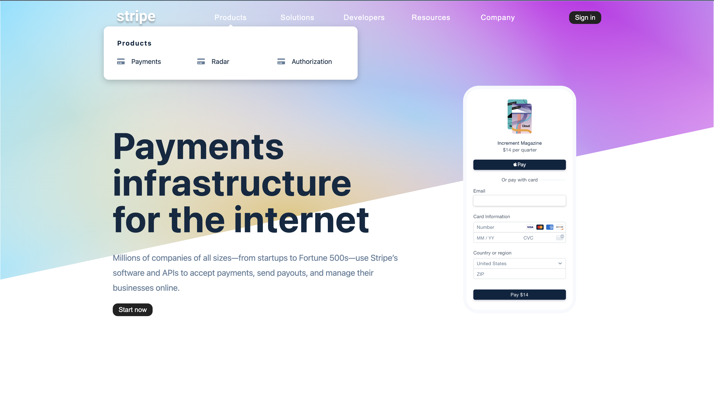
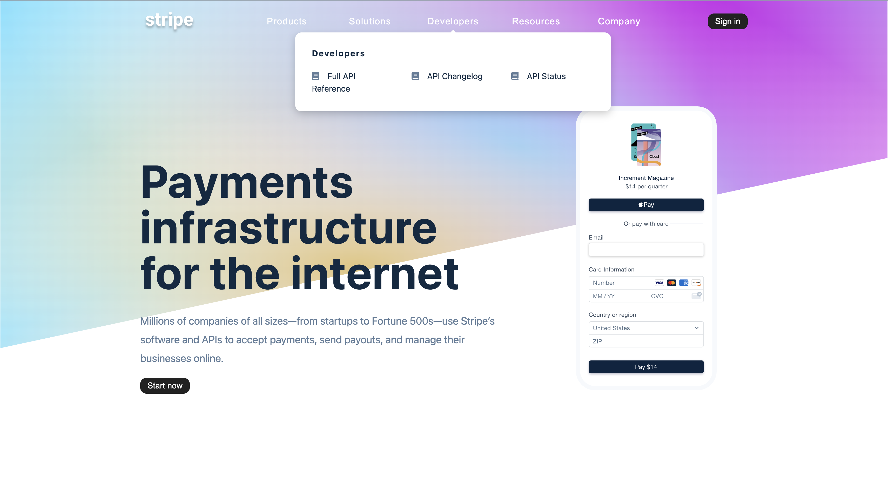

# Stripe-Style Navigation

A sophisticated, professional navigation system inspired by Stripe's website design. Features dynamic submenus, responsive sidebar navigation, and intelligent positioning with smooth hover interactions.

## Screenshots

### Homepage


### Menu-1


### Menu-2



## 🚀 Features

- **Dynamic Submenus**: Hover-triggered dropdown menus with intelligent positioning
- **Responsive Sidebar**: Mobile-friendly collapsible navigation
- **Smart Column Layout**: Automatic column adjustment based on content length
- **ES6 Module Architecture**: Clean separation of navigation data and logic
- **Precise Positioning**: Mouse-based submenu positioning for optimal UX
- **Professional Design**: Stripe-inspired clean and modern interface
- **Touch-Friendly**: Optimized for both desktop and mobile interactions

## 🏢 Navigation Structure

### Main Navigation Sections
- **Products**: Payment solutions and tools
- **Solutions**: Business-specific offerings
- **Developers**: API documentation and resources
- **Resources**: Support and educational content
- **Company**: About and corporate information

### Dynamic Features
- **Smart Columns**: 2-4 column layout based on content
- **Icon Integration**: Font Awesome icons for visual hierarchy
- **Hover Interactions**: Smooth show/hide animations
- **Mobile Sidebar**: Full-screen navigation on smaller devices

## 🛠️ Getting Started

### Prerequisites

- Modern web browser with ES6 module support
- Local server for module imports
- Font Awesome CDN access

### Installation

1. Clone or download the project files
2. Ensure you have the complete file structure:
   ```
   ├── index.html
   ├── app.js
   ├── data.js
   ├── styles.css (not included in provided files)
   ├── images/
   │   ├── logo.svg
   │   ├── phone.svg
   │   └── stripe.png
   └── README.md
   ```

### Running the Application

**Important**: ES6 modules require a local server:

1. **Using Live Server (VS Code)**:
   - Install Live Server extension
   - Right-click `index.html` → "Open with Live Server"

2. **Using Python**:
   ```bash
   python -m http.server 8000
   ```

3. **Using Node.js**:
   ```bash
   npx serve .
   ```

4. Navigate to `http://localhost:8000`

## 🎮 User Experience

### Desktop Navigation
- **Hover Interaction**: Hover over navigation buttons to reveal submenus
- **Smart Positioning**: Submenus position themselves optimally below buttons
- **Auto-Hide**: Submenus disappear when hovering away from navigation area
- **Column Adaptation**: Layout adjusts automatically based on number of links

### Mobile Navigation
- **Hamburger Menu**: Toggle button reveals full sidebar
- **Close Button**: Dedicated close button inside sidebar
- **Touch Optimized**: Large touch targets for mobile interaction
- **Scrollable Content**: Accommodates long navigation lists

## 🏗️ Technical Architecture

### File Structure

- **`index.html`**: Main structure with navigation and hero section
- **`app.js`**: Core navigation logic and event handling
- **`data.js`**: Navigation data as ES6 module
- **`styles.css`**: Styling and animations (referenced)
- **`images/`**: Logo, icons, and visual assets


## 🎯 Browser Compatibility

- **Chrome 61+**: Full ES6 module support
- **Firefox 60+**: Native module support
- **Safari 10.1+**: Module and modern JavaScript features
- **Edge 16+**: Complete compatibility

**Note**: Requires HTTPS or local server for ES6 modules.

## 📄 License

This project is open source and available for educational and commercial use. Stripe branding and specific design elements should be replaced for commercial use.

---

*Professional navigation for modern web applications - inspired by industry leaders.*