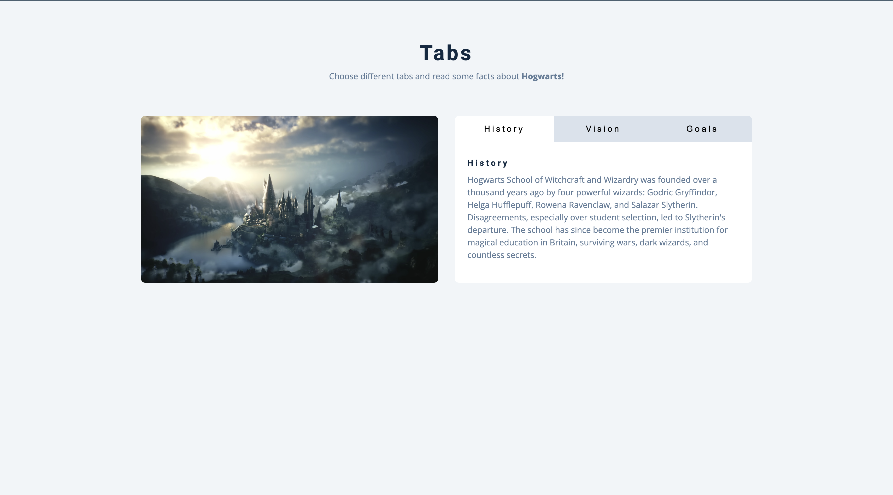

# Hogwarts Tabs Project

A responsive, interactive tab component showcasing facts about Hogwarts School of Witchcraft and Wizardry. This project demonstrates modern web development techniques with a magical Harry Potter theme.

## Screenshots

### Preview


## 🏰 Project Overview

This project features a clean, interactive tab interface that allows users to explore different aspects of Hogwarts:
- **History**: Learn about the founding of Hogwarts and its four founders
- **Vision**: Discover the school's mission and values
- **Goals**: Understand what Hogwarts aims to achieve for its students

## ✨ Features

- **Interactive Tab Navigation**: Smooth switching between different content sections
- **Responsive Design**: Works seamlessly across desktop, tablet, and mobile devices
- **Clean UI**: Modern, accessible interface with Harry Potter theming
- **Semantic HTML**: Well-structured markup for better accessibility
- **Vanilla JavaScript**: No external dependencies, pure JavaScript functionality

## 🛠️ Technologies Used

- **HTML5**: Semantic markup structure
- **CSS3**: Styling and responsive design
- **Vanilla JavaScript**: Interactive functionality and DOM manipulation

## 🚀 Getting Started

### Prerequisites

- A modern web browser
- A local web server (optional, for best experience)

### Installation

1. **Clone or download** the project files to your local machine

2. **Add missing assets**:
   - Add a `styles.css` file for styling
   - Add a `hogwarts.jpg` image file

3. **Open the project**:
   - Open `index.html` directly in your browser, or
   - Serve the files using a local web server for best results

### Quick Start

```bash
# If you have Python installed
python -m http.server 8000

# If you have Node.js installed
npx serve .

# Then open http://localhost:8000 in your browser
```

## 📱 Browser Compatibility

This project uses modern JavaScript features and should work in:
- Chrome 60+
- Firefox 55+
- Safari 10.1+
- Edge 79+


## 📄 License

This project is open source and available under the [MIT License](LICENSE).

---

*"It is our choices, Harry, that show what we truly are, far more than our abilities."* - Albus Dumbledore