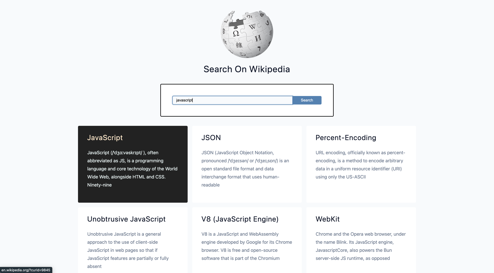

# Wikipedia Search Project

A modern, responsive Wikipedia search application that allows users to search and browse Wikipedia articles with a clean, intuitive interface. Built with vanilla JavaScript and the Wikipedia API.

## Screenshots

### Preview


## 🔍 Project Overview

This project provides a streamlined Wikipedia search experience:
- **Real-time Search**: Search Wikipedia articles instantly
- **Clean Results**: Well-formatted article previews with snippets
- **Direct Links**: Click to open full articles in new tabs
- **Error Handling**: Graceful handling of network issues and empty results
- **Loading States**: Visual feedback during search operations
- **Responsive Design**: Works seamlessly across all devices

## ✨ Features

- **Wikipedia API Integration**: Real-time search using Wikipedia's official API
- **Async/Await**: Modern JavaScript for smooth, non-blocking operations
- **Form Validation**: Input validation with user-friendly error messages
- **Loading Indicators**: Visual feedback during API calls
- **External Links**: Direct navigation to Wikipedia articles
- **Error Handling**: Comprehensive error management for various scenarios
- **Responsive Layout**: Mobile-first design approach
- **Accessibility**: Semantic HTML and proper form structure

## 🛠️ Technologies Used

- **HTML5**: Semantic markup and form elements
- **CSS3**: Modern styling and responsive design
- **Vanilla JavaScript**: ES6+ features including async/await
- **Wikipedia API**: Official Wikipedia search API
- **Fetch API**: Modern HTTP requests

## 🚀 Getting Started

### Prerequisites

- Modern web browser with JavaScript enabled
- Internet connection for Wikipedia API access
- Local web server (recommended for development)

### Installation

1. **Clone or download** the project files to your local machine

2. **Add required assets**:
   - Add a `styles.css` file for styling
   - Add a `wiki-logo.png` file for the Wikipedia logo

3. **Serve the project**:
   ```bash
   # Using Python
   python -m http.server 8000
   
   # Using Node.js
   npx serve .
   
   # Using PHP
   php -S localhost:8000
   
   # Then open http://localhost:8000 in your browser
   ```

### Quick Setup

```bash
# Create project directory
mkdir wikipedia-search
cd wikipedia-search

# Add your files
# - Copy index.html and app.js
# - Add wiki-logo.png
# - Create styles.css with your custom styling

# Serve locally
python -m http.server 8000
```

## 🎯 How It Works

### API Integration

The application uses Wikipedia's official search API:

```javascript
const url = 'https://en.wikipedia.org/w/api.php?action=query&list=search&srlimit=20&format=json&origin=*&srsearch=';
```

**API Parameters:**
- `action=query`: Perform a query operation
- `list=search`: Search for pages
- `srlimit=20`: Return up to 20 results
- `format=json`: Return JSON format
- `origin=*`: Enable CORS for browser requests
- `srsearch=`: Search term (appended dynamically)

### Search Flow

1. **Form Submission**: User enters search term and submits
2. **Validation**: Check if input is not empty
3. **API Call**: Fetch results from Wikipedia API
4. **Results Processing**: Parse and format the response
5. **Rendering**: Display results or error messages


## 📱 Browser Compatibility

**Modern Features Used:**
- Fetch API (Chrome 42+, Firefox 39+, Safari 10.1+)
- Async/Await (Chrome 55+, Firefox 52+, Safari 10.1+)
- ES6 Template Literals (Chrome 41+, Firefox 34+, Safari 9+)

**Fallbacks for Older Browsers:**
- Use XMLHttpRequest instead of Fetch
- Use Promises instead of async/await
- Use string concatenation instead of template literals

## 🤝 Contributing

Areas for contribution:
- Accessibility improvements (ARIA labels, keyboard navigation)
- Mobile optimization
- Performance enhancements
- Additional Wikipedia language support
- Advanced search features

## 📄 License

This project is open source and available under the [MIT License](LICENSE).


---

*"The best way to find out if you can trust somebody is to trust them - and the best way to learn APIs is to use them!"*