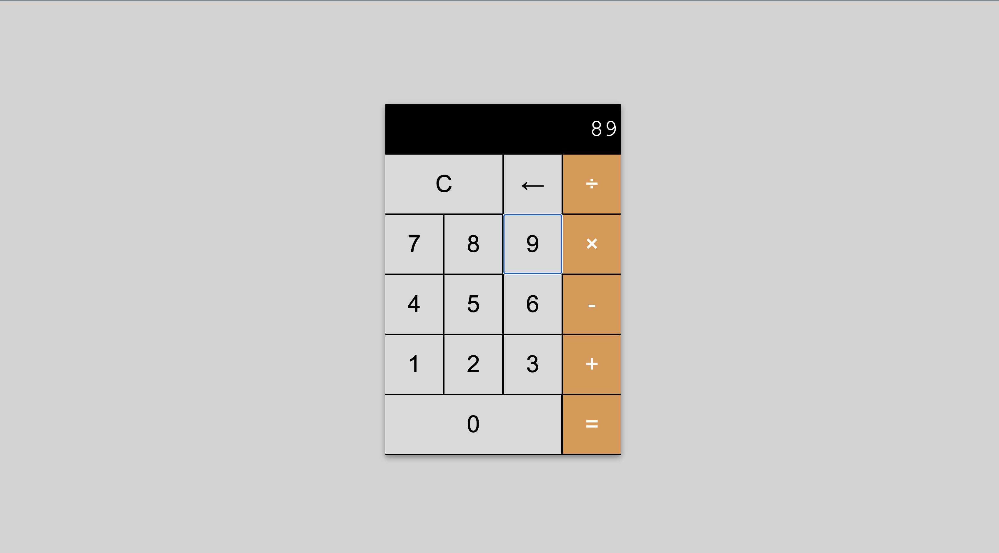

# Calculator 🧮

A functional web-based calculator built with HTML, CSS, and JavaScript. Perform basic arithmetic operations with a clean, intuitive interface that mimics traditional calculators.

## Screenshots

### Preview


## 🎯 Features

### Core Operations
- **Addition** (+): Add two or more numbers
- **Subtraction** (-): Subtract numbers
- **Multiplication** (×): Multiply numbers  
- **Division** (÷): Divide numbers
- **Equals** (=): Calculate and display results

### Calculator Functions
- **Clear** (C): Reset calculator to initial state
- **Backspace** (←): Delete the last entered digit
- **Continuous Operations**: Chain multiple calculations without clearing
- **Real-time Display**: See your input and results instantly

### User Interface
- **Digital Display**: Clear screen showing current numbers and results
- **Responsive Buttons**: Grid layout with properly sized buttons
- **Special Button Sizing**: 
  - Clear button spans 2 columns
  - Zero button spans 3 columns
- **Intuitive Layout**: Standard calculator button arrangement

## 🚀 Getting Started

### Prerequisites
- A modern web browser (Chrome, Firefox, Safari, Edge)

### Installation
1. Download or clone the project files
2. Ensure you have all three files in the same directory:
   - `calculator.html`
   - `calculator.js`
   - `calculator.css` (referenced but not provided)
3. Open `calculator.html` in your web browser

### Usage
Simply click the buttons to perform calculations:
1. **Enter numbers** by clicking digit buttons (0-9)
2. **Select operation** (+, -, ×, ÷)
3. **Enter second number**
4. **Press equals** (=) to see the result
5. **Continue calculating** or press C to clear

## 🔧 Technical Implementation

### Key JavaScript Components

#### State Management
- `runningTotal`: Stores the accumulated result of operations
- `buffer`: Current number being displayed/entered
- `previousOperator`: Tracks the last mathematical operation

#### Core Functions
- `buttonClick(value)`: Main event handler for all button clicks
- `handleNumber(value)`: Processes digit input
- `handleMath(value)`: Manages mathematical operations
- `handleSymbol(value)`: Handles special functions (C, =, ←)
- `flushOperation()`: Performs the actual calculations
- `rerender()`: Updates the display screen

#### Event Handling
- Single event listener on the button container
- Event delegation to handle all button clicks efficiently
- Dynamic button value detection using `event.target.innerText`

### Calculation Logic
```javascript
// Example calculation flow for "5 + 3 ="
1. Click "5" → buffer = "5"
2. Click "+" → runningTotal = 5, previousOperator = "+", buffer = "0"
3. Click "3" → buffer = "3"
4. Click "=" → runningTotal = 5 + 3 = 8, display result
```

## 🎨 Button Layout

```
┌─────────┬─────┬─────┐
│    C    │  ←  │  ÷  │
├─────┬───┼─────┼─────┤
│  7  │ 8 │  9  │  ×  │
├─────┼───┼─────┼─────┤
│  4  │ 5 │  6  │  -  │
├─────┼───┼─────┼─────┤
│  1  │ 2 │  3  │  +  │
├─────┴───┴─────┼─────┤
│       0       │  =  │
└───────────────┴─────┘
```

## 🔍 How It Works

### Input Processing
1. **Numbers**: Appended to current buffer (handles leading zeros)
2. **Operators**: Trigger calculation of previous operation, store new operator
3. **Equals**: Completes final calculation and displays result
4. **Clear**: Resets all values to initial state
5. **Backspace**: Removes last digit (handles single-digit case)

### Calculation Chain Example
```
Input: 10 + 5 × 2 =
Flow:
- Enter 10 → buffer: "10"
- Press + → runningTotal: 10, operator: "+"
- Enter 5 → buffer: "5"  
- Press × → calculate: 10+5=15, runningTotal: 15, operator: "×"
- Enter 2 → buffer: "2"
- Press = → calculate: 15×2=30, display: 30
```

## 📱 Browser Compatibility

- ✅ Chrome 60+
- ✅ Firefox 55+
- ✅ Safari 12+
- ✅ Edge 79+

## 📝 License

This project is open source and available under the [MIT License](LICENSE).

## 🎉 Ready to Calculate!

Start crunching numbers with this clean, functional calculator. Perfect for basic arithmetic and easily extensible for more advanced mathematical operations! 🔢